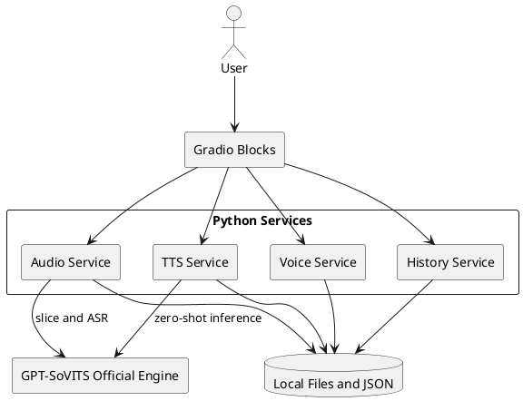

# New-Task1 AI Project Execution Plan

> 团队：4 人学生项目（前端、Python 业务、算法、数据/评测/文档各 1 人）  
> 周期：严格 4 周，每周必须交付可运行 Demo  
> 范围真值：`Project/Documents/newplan.md`  
> 页面真值：展示稿 2×2 只用于四页总览；运行时侧栏一项对应一个完整页面

---

## 一、项目架构与 MVP 范围定义 (System Architecture & MVP Scope)

### 1. 核心产品定位

面向本地 Windows GPU 的极简语音克隆工具：用户用 3–10 秒授权参考音频创建零样本音色，已有音色时通过“选音色 → 输入文本 → 点击合成”三步出声。

卖点是：**极简零样本克隆 + 可解释的情绪参考切换**。情绪来自同一说话人的不同参考片段，不包装成 GPT-SoVITS 原生情绪旋钮。

### 2. MVP 裁剪表 (Do & Don't)

| 类别 | 4 周内必须做 | 绝对不做 / 砍掉 |
|---|---|---|
| 运行架构 | 单体 Gradio Blocks，一个 `app.py` 启动；页面直接调用 Python services | FastAPI、Vue/React、数据库、Redis、第二套服务 |
| 页面结构 | 顶栏 + 左侧四项导航 + 右侧单页主区 | 四页 2×2 同屏、第五个“环境状态”页面 |
| 页面视觉 | 对齐展示稿：浅色紫蓝、卡片、波形、情绪胶囊、历史列表 | 积分、充值、真实登录、多用户 |
| 数据处理 | 上传授权、裁剪、标准化、静音切分、ASR、校对、四字段 `.list` | 专业 DAW、默认降噪、人声分离 |
| 音色克隆 | 零样本档案；真实试听成功后保存；重启恢复 | 少样本训练、新权重、独立 Speaker Embedding |
| 情绪 | 中性必有；有合法 `emotion_refs` 时手动切换；缺样本置灰 | 通用强度滑杆、模型级情绪控制 |
| 自动情绪 | 默认关闭的非阻断实验；低置信度回退中性 | 写成正式能力或周验收硬指标 |
| 韵律 | 小范围语速/停顿；Week 3 做轻量对照 | GRL/对抗训练、模型级解耦 |
| 结果 | WAV 播放/下载、历史、复用、删除 | 公网分享链接、假进度、假音频 |
| 可选加分 | MP3 在 FFmpeg 验证通过后显示 | 未验证就展示 MP3 |
| 安全 | 授权确认、路径限制、真实错误 | 水印、敏感词、生成检测、权限系统 |

### 3. 最终页面模型

```text
┌────────────────────────────────────────────────────────┐
│ AI 音频生成                 [帮助] [设置] [本地用户]      │
├──────────────┬─────────────────────────────────────────┤
│ ● 音频数据处理 │                                         │
│   音色样本克隆 │          当前选中的一个完整页面            │
│   文本生成语音 │                                         │
│   合成结果管理 │                                         │
│              │                                         │
│ 环境状态      │  ← 非导航项                              │
└──────────────┴─────────────────────────────────────────┘
```

四页职责：

1. **音频数据处理页**：上传、授权、波形、首尾裁剪、切分列表、转写预览。
2. **音色样本克隆页**：数据集切片/短参考选择、生成试听、保存音色、音色卡片墙。
3. **文本生成语音页**：文本、语种、音色、情绪胶囊、高级设置、合成。中性必须可用；开心、悲伤及其他情绪只有存在对应合法参考片段时才启用。
4. **合成结果管理页**：当前波形、播放/下载/导出、历史、复用、删除。

环境状态显示模型、FFmpeg、ASR、音色数和历史数，不是第五页。“剩余点数/充值”改成环境状态；用户区只显示“本地用户”；无授权素材时不展示角色音色卡。

跨页流程：

```text
音频页选片并“用于克隆” → 音色页带入音频和 ASR 文本
保存音色 → 音色卡片与合成页下拉立即刷新
合成成功 → 切到结果页并显示当前 WAV
历史复用 → 回到合成页并回填原参数
```

### 4. 技术架构图

```text
┌────────────────────────────────────────────┐
│ Gradio Blocks                               │
│ layout：顶栏 / 侧栏 / 页面显隐 / gr.State   │
│ audio / voice / tts / result 四页           │
└───────────────────┬────────────────────────┘
                    │ 页面事件直接调用
                    ▼
┌────────────────────────────────────────────┐
│ Python services                             │
│ audio：裁剪 / 标准化 / 切分 / ASR            │
│ voice：试听 / 档案 / 全局索引                 │
│ tts：Speaker + Prosody 条件 / 官方推理        │
│ history：结果 / 历史 / 复用 / 删除            │
└───────────────┬──────────────────┬─────────┘
                ▼                  ▼
┌──────────────────────┐  ┌──────────────────────┐
│ GPT-SoVITS 官方能力    │  │ 本地文件 + 原子 JSON  │
│ TTS.py / 切分 / ASR    │  │ datasets/voices/... │
└──────────────────────┘  └──────────────────────┘
```



架构纪律：

- `app.py` 是唯一入口，启用 Gradio `queue()`，本期 GPU 重任务一次一个。
- 页面只负责交互，业务规则全部进入 services。
- `tts_service.py` 进程内封装官方 `TTS.py`；`api_v2.py` 只用于参数核对。
- “生成音色”只生成真实试听；“保存音色”才写正式档案。
- 单音色档案：`data/voices/{voice_id}/voice.json`。
- 全局索引：`data/index/voices.json`、`data/index/history.json`。

建议目录：

```text
Project/
├─ app.py
├─ ui/{layout,audio_page,voice_page,tts_page,result_page}.py
├─ services/{audio_service,voice_service,tts_service,history_service}.py
├─ models/schemas.py
├─ assets/{theme.css,preview_prompt.txt,authorized_presets/}
├─ data/{uploads,datasets,voices,outputs,index}/
├─ tests/
├─ requirements.txt
└─ README.md
```

---

## 二、4 人协同分工矩阵 (RACI / Role Assignment)

### 1. RACI

| 工作包 | WGX 前端 | LHY Python 业务 | LJQ 算法 | CXY 评测文档 |
|---|---:|---:|---:|---:|
| 页面壳、侧栏与四页 | R | C | I | A |
| 跨页状态与浏览器体验 | R | C | I | A |
| services、schemas、JSON | C | R | C | A |
| `app.py` 与集成 | C | R | C | A |
| GPT-SoVITS 环境与适配 | I | C | R | A |
| 切分/ASR 与参考规范 | C | C | R | A |
| 非 GPU 单元测试 | C | R | C | A |
| GPU 冒烟和连续合成 | I | C | R | A |
| 每周 Demo 与范围冻结 | R | R | R | A |
| README、视频、PPT | C | C | C | R/A |

R = 执行，A = 对验收负责，C = 协作，I = 知情。

### 2. WGX：前端开发

交付：`layout.py`、四个独立页面、页面显隐、共享 `gr.State`、跨页带入/刷新/跳转/回填、展示稿主题、四态反馈和浏览器测试。

严禁：2×2 同屏、第五页面、Vue/React、积分充值、真登录、未授权音色、固定 WAV 或假任务状态。

### 3. LHY：Python 业务与集成

交付：四个 services、schemas、文件校验、路径限制、原子 JSON、损坏重建、`app.py`、queue、日志和非 GPU 单测。

严禁：增加独立 Web API、数据库、Redis/Celery；修改模型核心；用 Mock 音频作为集成证据。

### 4. LJQ：算法与模型控制

交付：实际环境记录、官方零样本/切分/ASR 基线、TTS 调用参数与异常、参考音频规范、情绪映射、Week 3 双条件对照。

严禁：训练新权重、做 GRL/对抗解耦、修改官方推理核心、整仓引入第三方情绪 Demo、伪造准确率。

### 5. CXY：数据、评测、文档与验收

交付：授权清单、5 条回归文本、试听文本、契约、每周 DoD、听测、证据矩阵、README、视频、PPT 和最终签字。

严禁：把计划写成已实现、恢复训练/水印/SaaS、使用假音色、最后一周才补文档。

### 6. 协作规则

1. Week 1 周中形成服务函数和字段草案。
2. Week 2 保存第一个音色前冻结契约。
3. 每周四集成预演；周五禁止合并新功能，只修 Demo 阻断项。
4. GPU 重任务一次一个，由 LJQ 安排。
5. 允许结对帮助，但主责人必须能解释和验收自己的模块。

---

## 三、4 周里程碑与冲刺计划 (4-Week Sprint Plan)

统一执行规则：单个节点原则上不超过 1.5 人日；周三中午前形成最小可集成产物，周四预演，周五只修阻断问题。节点阻塞超过半天必须结对或按风险表降级。

### Week 1 — Baseline & Pipeline

目标：引擎真实出声，Gradio 壳和 services 骨架可运行。

- WGX：顶栏、四项侧栏、环境状态、四页空壳、基础主题和显隐。
- LHY：`app.py`、services 骨架、schemas、日志、queue。
- LJQ：锁定实际版本；零样本 3 条 WAV；切分/ASR 各一次。
- CXY：授权清单、固定文本、契约草案、验收表。

DoD：

- [ ] 3 条本机真实 WAV 与一组切分/ASR 输出。
- [ ] 主 Demo 机和实际存在的每种 GPU 环境轨道均有真实 WAV 与日志；不要求不承担模型执行的成员重复推理。
- [ ] 一个命令打开页面，四项侧栏切换且主区一次一页。
- [ ] 页面信息架构、导航文案和模型主版本冻结。
- [ ] services 函数、核心字段和统一错误对象形成草案。

只做到官方 WebUI 出声时记“部分通过”，不得写成项目闭环。

### Week 2 — Audio & Voice

目标：完成“音频处理 → 选片 → 生成试听 → 保存音色”。

- WGX：音频页、音色页、切片带入、卡片墙和失败态。
- LHY：上传/裁剪/标准化/切分/ASR、音色档案和索引。
- LJQ：参考质量规范、试听参数和错误条件。
- CXY：`.list` 抽检、失败用例和契约定稿。

DoD：

- [ ] 合法 `dataset.list` 与 `dataset.json`。
- [ ] 3–10 秒切片可从音频页带入音色页并带入 ASR 文本。
- [ ] 直接上传短参考的备用路径可用。
- [ ] “生成音色”产生真实 `preview.wav`，不提前建档。
- [ ] “保存音色”写 `voice.json` 和 `voices.json`，重启恢复。
- [ ] 保存首个音色前冻结契约。

执行时先并行跑通“合法短参考 → 试听 → 保存 → 重启恢复”和完整音频处理，音色保存不得硬等待切分/ASR 全部完成。

本周不要求合成页和结果历史完成。

### Week 3 — TTS, Results & Emotion

目标：完成核心闭环、历史与轻量条件对照。

- WGX：合成页、结果页、音色刷新、成功跳页、历史复用回填。
- LHY：TTS、历史、原子写入、单任务互斥、失败不写成功；有合法情绪素材时实现 `add_emotion_reference` 写入链路。
- LJQ：中性基线、手动情绪映射、双条件对照。
- CXY：5 条回归、听测和联调清单。

轻量实验只做：

```text
固定 voice_id、文本、引擎
→ 只换 emotion_refs
→ 或只改 speed_factor / fragment_interval
→ 记录明显、较弱、无效、失真、音色漂移
```

DoD：

- [ ] 保存音色后合成页立即可选。
- [ ] 5 条固定文本各有回归 WAV，其中至少 3 条在同一服务实例中连续成功。
- [ ] 合成成功切结果页；历史可播放、下载、复用和删除。
- [ ] 中性稳定；缺情绪参考时置灰。
- [ ] 有合法素材时完成一组情绪对照；没有素材不阻断 MVP。
- [ ] 自动情绪始终不作为通过条件。

Week 3 后冻结主功能。

### Week 4 — Polish & Defense Prep

目标：稳定、视觉、视频、PPT 与 Demo 冻结。

- WGX：展示稿主题、侧栏高亮、卡片、四态、浏览器兼容。
- LHY：文件缺失、模型离线、ASR 失败、OOM/超时处理。
- LJQ：最终回归样音、资源检查、演示参数冻结。
- CXY：README、限制、视频、PPT 和 8–10 分钟脚本。

DoD：

- [ ] 相关 pytest 通过，GPU 测试独立标记。
- [ ] 停止旧服务后，以全新实例走通完整流程。
- [ ] Windows 目标浏览器可播放和下载。
- [ ] 未授权、音频无效、ASR 失败、模型未加载、显存不足有提示。
- [ ] 视频、PPT、README 与实际功能一致。
- [ ] 答辩前 48 小时停止加功能。

最终演示：音频页上传/裁剪/切分/ASR → 带入音色页生成试听并保存 → 合成页生成 → 结果页播放/下载/历史/复用 → 重启验证。情绪只有在有合法素材时演示。

---

## 四、风险管理与降级预案 (Risk Management & Fallback)

功能保留顺序：

```text
中性真实合成
→ 音色保存与重启
→ WAV 播放/下载
→ 历史与复用
→ 手动情绪
→ 自动情绪实验
→ 视觉细节
```

| 风险 | Trigger | Fallback Plan |
|---|---|---|
| 算法不出声 | Week 1 周三仍无 1 条本机 WAV | 停止页面精修，优先修环境；对照 [GPU Environment Baseline.md](GPU%20Environment%20Baseline.md) 确认 Track A/B；Week 1 记部分通过 |
| 40/50 系环境不一致 | 组员 PyTorch/CUDA 不同导致“你这边能跑我这边不行” | 不共用 venv；统一模型与业务代码，每人按双轨道填基线表；LJQ 维护全组矩阵 |
| 单体集成未通 | 官方 WebUI 出声但 `app.py` 未接入 | Week 2 首任务补齐，不把官方旁证当项目闭环 |
| 音频→音色断链 | Week 2 周三不能带入片段和文本 | 用“直接上传短参考”保真实试听，继续修跨页 |
| 情绪效果失败 | 无效、失真或音色漂移 | 主 Demo 只展示中性，如实记录 |
| 无合法情绪素材 | Week 3 前仍无同说话人素材 | 开心/悲伤置灰，不阻断 MVP |
| 自动分类失败 | 半天仍装不上或频繁误判 | 关闭并隐藏实验入口 |
| 时间不足 | 周四主路径仍未串通 | 按固定保留顺序砍增强 |
| 显存不足/超时 | OOM 或短句超过约定时间 | 关闭其他模型、单任务串行、缩短文本 |
| ASR 失败 | 下载失败或转写不可用 | 允许手工输入/校对文本 |
| FFmpeg/MP3 失败 | MP3 无法稳定播放下载 | 隐藏 MP3，只保 WAV |
| JSON 损坏 | 索引读取失败 | 从目录重建，不清空用户数据 |
| Gradio 样式受限 | 精修超过 1 人日仍不稳定 | 保交互和信息层级，不换技术栈 |
| 展示稿被误解 | 出现 2×2 同屏或第五导航 | 立即改回四项侧栏 + 单页主区 |
| 组员缺席 | 主责缺席一天且阻断 DoD | 协作角色接最小交付，砍增强项 |

每周 Demo 必须现场运行本项目真实链路，预跑 WAV 不得代替验收。最终答辩若现场 OOM，可播放同版本预跑 WAV，但必须明确说明降级；资源允许时，再现场生成一条短句证明链路仍可运行。

### 最终完成标准

- [ ] 一个命令启动 Gradio。
- [ ] 侧栏四项各对应一个页面，主区不做 2×2。
- [ ] 音频处理、音色试听/保存、TTS、结果历史形成真实闭环。
- [ ] 同一音色连续 3 次真实合成。
- [ ] 音色和历史重启恢复。
- [ ] WAV 可播放、下载和复用。
- [ ] 情绪按真实素材显示，自动模式默认关闭。
- [ ] 无假音频、假权重、假进度或无依据指标。

---

## 依据

- 统一范围：`Project/Documents/newplan.md`
- GPU 环境（40/50 双轨道）：`Project/Documents/GPU Environment Baseline.md`
- GPT-SoVITS：<https://github.com/RVC-Boss/GPT-SoVITS>
- Gradio Blocks：<https://www.gradio.app/docs/gradio/blocks>
- Gradio 主题：<https://www.gradio.app/guides/theming-guide>
- 情绪参考切换思路：<https://github.com/2DIPW/gpt_sovits_infer_with_emotion>（仅借鉴思路）

凡未产生真实音频、文件、测试或日志的能力，不得写成“已实现”。
