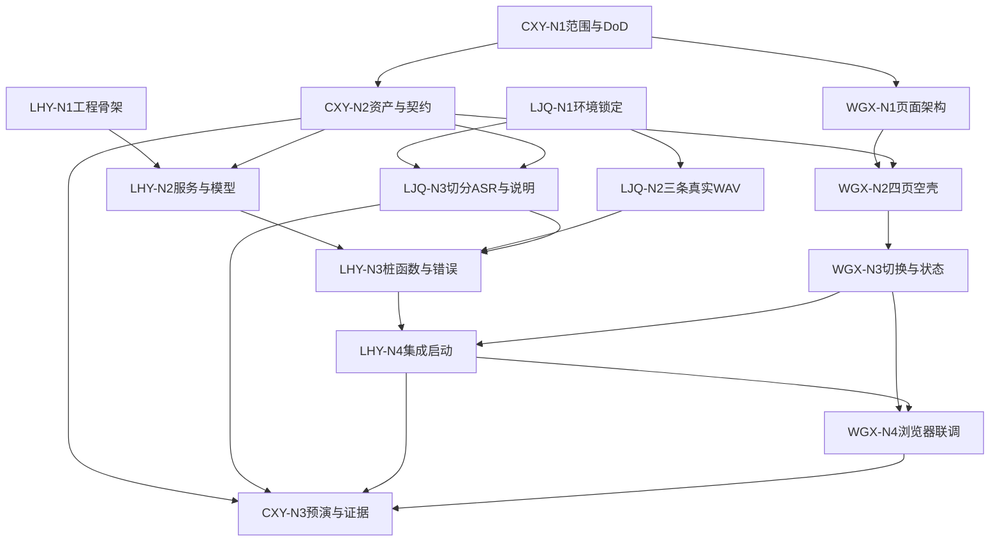

# Week 1 节点化开发计划：总览

> 本周目标：真实模型出声 + Gradio 四页工程壳 + Python services 骨架 + 可执行交接约定。  
> 工作方式：四人先沿各自节点链独立推进，依赖满足后汇合，最后统一验收。

## 1. 三个协作指标

每个节点必须回答：

1. **哪些人的工作会影响我？**  
   只写启动条件和上游依赖，不写日期或时刻，并区分：
   - 可立即开始：无外部依赖；
   - 软依赖：可先做骨架，收到结果后对齐；
   - 硬依赖：收到指定交付物后才能开始。

2. **我需要交付什么内容？**  
   必须是可检查的文件、代码、页面、真实 WAV、日志或文档，不能只写“完成研究”。

3. **谁需要等待我完成该工作？**  
   写明接收人和用途；没有下游时写“无”。

## 2. 节点状态

| 状态 | 含义 | 下一步 |
|---|---|---|
| 未开始 | 启动条件尚未满足 | 查看自己在等待谁 |
| 可开始 | 输入已经满足 | 立即开始 |
| 进行中 | 正在产出 | 更新阻塞和预计交付时间 |
| 待交接 | 已产出但接收人未确认 | 发出路径并要求确认 |
| 已完成 | 接收人确认且完成判定通过 | 进入下一节点 |
| 阻塞 | 技术或外部条件导致停止 | 当天通知 CXY 并触发降级 |

### 执行节奏与容量

- 单个节点预计不超过 **1.5 人日**；超过时必须拆成“最小可验收部分”和“增强部分”。
- 周三中午前必须交付各链路的最小可集成产物；周四只做集成预演和阻断修复；周五不合并新功能。
- 节点阻塞超过半天时，由主责人通知 CXY，并指定一名结对协助人；解释和验收责任仍由主责人承担。
- 每次交接必须包含产物路径、运行方式、已知限制和接收人确认，不能只口头说明“已完成”。

## 3. 四人独立执行文件

- [CXY Nodes.md](WorkScheduleGuide/CXY%20Nodes.md)：范围、资产、契约、预演与验收。
- [LJQ Nodes.md](WorkScheduleGuide/LJQ%20Nodes.md)：环境、零样本 TTS、切分/ASR 与算法交接。
- [LHY Nodes.md](WorkScheduleGuide/LHY%20Nodes.md)：工程骨架、services、错误处理和一键集成。
- [WGX Nodes.md](WorkScheduleGuide/WGX%20Nodes.md)：页面结构、四页空壳、切换、状态与浏览器联调。
- [GPU Environment Baseline.md](../GPU%20Environment%20Baseline.md)：**40 系 / 50 系双轨道环境基线**（LJQ 主责填写，全组对照）。

每个人只修改自己主责的工程；允许结对帮助，但节点交付和解释责任不转移。

## 4. 节点链

```text
CXY：CXY-N1 范围与验收
  → CXY-N2 授权资产与契约
  → CXY-N3 预演与证据

LJQ：LJQ-N1 环境锁定
  ├→ LJQ-N2 三条真实WAV
  └→ LJQ-N3 切分/ASR与算法说明

LHY：LHY-N1 工程骨架
  → LHY-N2 services与schemas
  → LHY-N3 日志/错误/桩函数
  → LHY-N4 集成UI与一键启动

WGX：WGX-N1 页面架构
  → WGX-N2 四页空壳与主题
  → WGX-N3 切换与State
  → WGX-N4 浏览器联调
```

## 5. 跨角色依赖



四条工作链只在 LHY-N4 集成节点强制汇合。在此之前：

- WGX 不等待模型出声即可完成页面壳。
- LJQ 不等待页面或 services 即可跑官方模型；环境锁定后，TTS 基线与切分/ASR 并行执行。
- LHY 不等待 UI 完成即可建立工程和服务骨架。
- CXY 不替代其他三人编码，只提供契约和验收。

## 6. 关键交接

| 交接物 | 发出 → 接收 | 触发的下游工作 | 用途 |
|---|---|---|---|
| DoD 与导航文案 | CXY-N1 → WGX/LHY/LJQ | WGX-N1、LHY-N1、LJQ验收准备 | 统一范围与命名 |
| 授权资产、文本、契约 v0.1 | CXY-N2 → LJQ/LHY/WGX | LJQ-N2/N3、LHY-N2、WGX-N2 | 统一输入和字段 |
| 环境记录与全组矩阵 | LJQ-N1 → LHY/CXY | LHY-N3、CXY-N3 | 固定模型入口；见 [GPU Environment Baseline.md](../GPU%20Environment%20Baseline.md) |
| 3 条 WAV 与参数 | LJQ-N2 → LHY/CXY | LHY-N3、CXY-N3 | TTS 对齐与证据 |
| 切分/ASR 与算法说明 | LJQ-N3 → LHY/CXY | LHY-N3、CXY-N3 | 音频接口对齐 |
| UI 模块与 State | WGX-N3 → LHY-N4 | LHY-N4 | 应用集成 |
| 一键启动集成版 | LHY-N4 → WGX/CXY | WGX-N4、CXY-N3 | 联调和预演 |
| 浏览器检查与截图 | WGX-N4 → CXY-N3 | CXY-N3最终验收 | 页面证据 |

发出人必须提供产物路径、版本和完成判定；接收人半天内回复“已接收”或问题。未确认的节点保持“待交接”。

## 7. AI 使用规则

- 提示词使用前补充真实路径、版本和输入。
- AI 可以阅读源码、起草实现和生成测试，但负责人必须审查。
- 不上传 `.env`、密钥、个人信息或未经授权的声音。
- 不执行来源不明的安装、删除或模型下载命令。
- AI 结论、Mock 音频和固定假状态不能作为验收证据。

## 8. 阶段 Demo

1. LHY 使用一个命令启动 `app.py`。
2. WGX 展示顶栏、四项侧栏、环境状态和四页单页切换。
3. LJQ 播放本周本机生成的 3 条真实 WAV，并展示日志。
4. LJQ 展示一次真实切分和 ASR 结果。
5. CXY 展示契约草案、证据清单和验收结论。

验收：

- [ ] 一个命令打开 Gradio。
- [ ] 侧栏只有四项，主区一次只显示一页。
- [ ] 环境状态不是第五个页面。
- [ ] 3 条 WAV 来自本机本周真实推理。
- [ ] 至少一组真实切分和 ASR 输出。
- [ ] services、schemas、日志和错误结构已有骨架。
- [ ] 授权素材、固定文本、契约和交接记录完整。
- [ ] [GPU 环境矩阵](../GPU%20Environment%20Baseline.md) 四人各有记录；主 Demo 机至少 1 条真实 WAV，实际存在的每种 GPU 环境轨道（40 系/50 系）至少各有 1 条本轨道真实 WAV 与日志。无 GPU 或不承担模型执行的成员只需完成环境记录，不强制重复生成。

若只有官方 WebUI 出声而本项目未接入，Week 1 记“部分通过”。不得用预跑音频、Mock 或 AI 判断替代现场验收。

## 9. 本阶段不做

- 不完成 Week 2/3 的音频处理、音色保存、TTS 历史等业务。
- 不训练权重，不做模型级解耦。
- 不增加 FastAPI、Vue/React、数据库或任务平台。
- 不把四页做成 2×2 同屏。
- 不实现积分、充值、真登录或公网分享。
