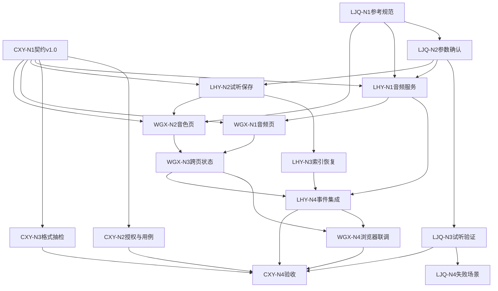

# Week 2 节点化开发计划：总览

> 本周目标：完成“音频处理 → 选择 3–10 秒片段 → 带入音色页 → 生成真实试听 → 保存音色 → 重启恢复”。  
> 工作方式：四人沿独立节点链推进，只在契约冻结、事件集成和最终验收处汇合。

## 1. 三个协作指标

每个节点必须回答：

1. **哪些人的工作会影响我？**  
   只描述上游依赖，不写时间：
   - 无依赖：可独立开始；
   - 软依赖：可先工作，收到结果后对齐；
   - 硬依赖：必须收到指定交付物才能继续。

2. **我需要交付什么内容？**  
   必须是可检查的代码、页面、真实音频、JSON、日志、测试或文档。

3. **谁需要等待我完成该工作？**  
   写明接收人和用途；没有下游时写“无”。

节点状态沿用 Week 1：未开始、可开始、进行中、待交接、已完成、阻塞。

### 执行节奏与容量

- 单个节点预计不超过 **1.5 人日**；超过时拆分最小闭环和增强项。
- 周三中午前必须先跑通“合法短参考 → 真实试听 → 保存音色 → 重启恢复”的保底链路。
- 周四接入完整音频处理和跨页流程并预演；周五只修阻断问题和收集证据。
- LHY 阻塞超过半天时，LJQ 结对处理模型入口与参数，WGX 结对处理事件绑定，避免集成工作全部排队等待。

## 2. 四人独立执行文件

- [CXY Nodes.md](WorkScheduleGuide/CXY%20Nodes.md)：DoD、契约、授权、失败用例、格式抽检和验收。
- [LJQ Nodes.md](WorkScheduleGuide/LJQ%20Nodes.md)：参考规范、算法参数、真实试听验证和失败场景。
- [LHY Nodes.md](WorkScheduleGuide/LHY%20Nodes.md)：音频服务、音色服务、原子索引、重启恢复和事件集成。
- [WGX Nodes.md](WorkScheduleGuide/WGX%20Nodes.md)：音频页、音色页、跨页状态和浏览器联调。
- [GPU Environment Baseline.md](../GPU%20Environment%20Baseline.md)：40 系 / 50 系环境矩阵；GPU 冒烟前对照。

## 3. 工程主流程


备用路径：

```text
直接上传合格的 3–10 秒短参考
→ 填写准确参考文本
→ 生成真实试听
→ 保存音色
```

备用路径用于主跨页流程受阻时继续验证真实试听与保存，不能替代对跨页问题的记录和修复。

执行优先级：先保证备用路径形成真实、可持久化的最小闭环，再把完整音频处理链接入同一套 service。这样可以控制 LHY 的关键路径，但 Week 2 最终验收仍要求主跨页流程；未完成时必须记为“部分通过”。

## 4. 四条节点链

```text
CXY：CXY-N1 DoD与契约v1.0
  ├→ CXY-N2 授权与失败用例 ─┐
  └→ CXY-N3 数据格式抽检 ───┴→ CXY-N4 端到端验收

LJQ：LJQ-N1 参考音频规范
  → LJQ-N2 切分/ASR/试听参数
  → LJQ-N3 项目内真实试听验证
  → LJQ-N4 试听失败场景

LHY：LHY-N1 audio_service ─────────────────┐
     LHY-N2 voice_service试听与保存 → LHY-N3 原子索引与重启恢复 ─┴→ LHY-N4 页面事件集成

WGX：WGX-N1 音频页交互 ─┐
     WGX-N2 音色页交互 ─┴→ WGX-N3 跨页带入与State
  → WGX-N4 浏览器联调
```

## 5. 跨角色依赖



避免循环等待：

- CXY-N1 先给出契约草案；首次正式保存音色前必须冻结 v1.0。
- WGX 不等待 GPU 即可完成页面，收到 service 返回结构后对齐。
- LHY 不等待 UI 即可实现 services 和测试；`voice_service` 可直接使用合法 3–10 秒短参考，不硬等待完整 `audio_service`。
- LJQ 不等待页面即可确认官方参数和参考音频规范。
- LHY-N4 是 UI 与 services 的统一汇合节点。

## 6. 关键交接

| 交接物 | 发出 → 接收 | 触发的下游工作 | 用途 |
|---|---|---|---|
| Week 2 DoD 与契约 v1.0 | CXY-N1 → 全员 | LHY-N1/N2、WGX-N1/N2 | 字段和验收对齐 |
| 参考音频规范 | LJQ-N1 → LHY/WGX/CXY | 校验规则与页面提示 | 固定 3–10 秒要求 |
| 切分/ASR/试听参数 | LJQ-N2 → LHY | LHY-N1/N2 | 封装官方能力 |
| `audio_service` 与数据集样例 | LHY-N1 → WGX/CXY | WGX-N1、CXY-N3 | 页面绑定和抽检 |
| `voice_service` 与真实试听入口 | LHY-N2 → WGX/LJQ | WGX-N2、LJQ-N3 | 试听与保存 |
| 真实试听验证记录 | LJQ-N3 → CXY | CXY-N4 | 证明 preview 来自项目真实推理 |
| 跨页 State 与事件 | WGX-N3 → LHY | LHY-N4 | 页面集成 |
| 原子索引与恢复 | LHY-N3 → CXY | CXY-N3/N4 | 档案和重启证据 |
| 集成版 `app.py` | LHY-N4 → WGX/CXY | WGX-N4、CXY-N4 | 联调与预演 |
| 浏览器结果与截图 | WGX-N4 → CXY | CXY-N4 | 页面证据 |

## 7. AI 使用规则

- 提示词使用前补充实际路径、契约、源码版本和真实输入。
- AI 可帮助实现和审查，但负责人必须运行测试并检查输出。
- 不上传未经授权声音、密钥、个人信息或 `.env`。
- 不执行来源不明的依赖安装或删除命令。
- 不允许 AI 生成假的 ASR、切片、`preview.wav`、档案或成功状态。

## 8. 阶段 Demo

1. 一个命令启动 `app.py`。
2. 上传授权音频，完成裁剪、切分、ASR 与人工修正。
3. 生成真实 `dataset.list` 和 `dataset.json`。
4. 选择 3–10 秒片段并带入音色页。
5. 使用真实 GPT-SoVITS 生成 `preview.wav`。
6. 试听成功后保存音色，展示 `voice.json` 与 `voices.json`。
7. 停止并重新启动应用，确认音色卡片仍可加载。
8. 额外展示直接上传短参考的备用路径。

验收：

- [ ] `.list` 四字段正确，`dataset.json` 可追溯。
- [ ] 合法片段能带入，非法时长被阻断。
- [ ] “生成音色”不提前写正式档案。
- [ ] “保存音色”只在真实试听成功后启用。
- [ ] `voice.json`、`voices.json` 与文件目录一致。
- [ ] 重启后音色恢复。
- [ ] 失败提示与日志真实，不使用 Mock。

## 9. 本阶段不做

- 不实现文本生成语音页的正式业务。
- 不实现结果管理和 `history.json`。
- 不追加多情绪参考，不做自动情绪分类。
- 不进行少样本训练或模型级解耦。
- 不增加独立 API、数据库或第二套前端。

## 10. GPU 与环境（40 系 / 50 系）

全组可能混用 RTX 40 系与 50 系，驱动与 PyTorch/CUDA 组合可以不同，**不要求统一 conda 环境**。

- 真值文档：[GPU Environment Baseline.md](../GPU%20Environment%20Baseline.md)
- Week 2 验收：`preview.wav` 必须来自**本机**项目真实推理；40/50 轨道分别通过即可。
- 环境变更（换包、换 PyTorch、换机器）后 24 小时内更新个人基线表与全组矩阵。
- 答辩主 Demo 选最稳定的一台；其余成员以本机 WAV + 日志作补充证据。
