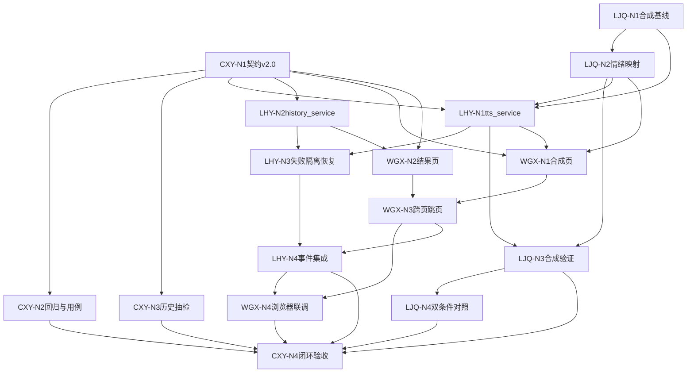

# Week 3 节点化开发计划：总览

> 本周目标：完成“选音色 → 输入文本 → 真实合成 → 结果页播放/下载/历史 → 复用回填”的产品闭环；接入手动情绪参考切换，并完成轻量双条件对照。  
> 工作方式：四人沿独立节点链推进，在契约冻结、事件集成和最终验收处汇合。

## 1. 三个协作指标

每个节点必须回答：

1. **哪些人的工作会影响我？**  
   只描述上游依赖，不写时间：
   - 无依赖：可独立开始；
   - 软依赖：可先工作，收到结果后对齐；
   - 硬依赖：必须收到指定交付物才能继续。

2. **我需要交付什么内容？**  
   必须是可检查的代码、页面、真实音频、JSON、日志、测试或文档。

3. **谁需要等待我完成该工作？**  
   写明接收人和用途；没有下游时写“无”。

节点状态沿用 Week 1/2：未开始、可开始、进行中、待交接、已完成、阻塞。

### 执行节奏与容量

- 单个节点预计不超过 **1.5 人日**；周三中午前必须有可集成的中性合成与历史服务最小版本。
- `tts_service` 与 `history_service` 按冻结契约并行实现，只有最终“合成成功后写历史”绑定需要汇合。
- 情绪样本追加属于条件功能：周三前没有合法同说话人素材，立即按“中性必做、其他情绪置灰”收口。
- 周四完成 5 条回归、跨页闭环与重启预演；周五不再增加主功能。

## 2. 四人独立执行文件

- [CXY Nodes.md](CXY%20Nodes.md)：DoD、契约 v2.0、回归听测、失败用例、抽检与验收。
- [LJQ Nodes.md](LJQ%20Nodes.md)：中性合成基线、情绪映射、项目内合成验证、双条件对照与失败场景。
- [LHY Nodes.md](LHY%20Nodes.md)：`tts_service`、`history_service`、失败不写成功历史、重启恢复与事件集成。
- [WGX Nodes.md](WGX%20Nodes.md)：合成页、结果页、跨页跳页与复用回填、浏览器联调。
- [GPU Environment Baseline.md](../GPU%20Environment%20Baseline.md)：40 系 / 50 系环境矩阵；合成冒烟前对照。

## 3. 工程主流程


情绪与对照（本周最小范围）：

```text
固定 voice_id + 固定文本 + 固定引擎
→ 只换 emotion_refs（中性 / 开心 / 悲伤）
→ 或只改 speed_factor / fragment_interval
→ 记录：明显 / 较弱 / 无效 / 失真 / 音色漂移
```

自动情绪分类如有余力可作为**默认关闭**的实验开关，**不作为本周 DoD**。

## 4. 四条节点链

```text
CXY：CXY-N1 DoD与契约v2.0
  ├→ CXY-N2 回归听测与失败用例 ─┐
  └→ CXY-N3 合成与历史抽检 ─────┴→ CXY-N4 产品闭环验收

LJQ：LJQ-N1 中性合成基线与TTS参数
  → LJQ-N2 情绪映射与emotion_refs规则
  → LJQ-N3 项目内真实合成验证
  → LJQ-N4 双条件对照与合成失败场景

LHY：LHY-N1 tts_service合成
  ├→ LHY-N3 失败隔离与历史重启恢复
     LHY-N2 history_service与原子索引 ─┘
  → LHY-N4 合成页与结果页事件集成

WGX：WGX-N1 合成页交互 ─┐
     WGX-N2 结果页交互 ─┴→ WGX-N3 跨页跳页与复用State
  → WGX-N4 浏览器联调
```

## 5. 跨角色依赖



避免循环等待：

- CXY-N1 先给出契约 v2.0 草案；首次写入 `history.json` 前必须冻结。
- WGX 不等待 GPU 即可完成合成页/结果页控件，收到 service 返回结构后对齐。
- LHY 不等待 UI 即可并行实现 `tts_service` 和 `history_service`；历史服务先用冻结 schema 与构造的合法记录做单测，不等待真实 GPU 输出。
- LJQ 不等待页面即可确认合成参数和情绪映射。
- LHY-N4 是合成/结果页与 services 的统一汇合节点。

## 6. 关键交接

| 交接物 | 发出 → 接收 | 触发的下游工作 | 用途 |
|---|---|---|---|
| Week 3 DoD 与契约 v2.0 | CXY-N1 → 全员 | LHY-N1/N2、WGX-N1/N2 | 合成与历史字段对齐 |
| 中性合成与 TTS 参数 | LJQ-N1 → LHY/WGX | LHY-N1、WGX-N1 | 封装正式合成 |
| 情绪映射与置灰规则 | LJQ-N2 → LHY/WGX/CXY | LHY-N1、WGX-N1、CXY-N2 | 手动情绪切换 |
| 情绪参考写入接口与入口 | LHY-N1/WGX-N1 → LJQ/CXY | 情绪对照与验收 | 真实维护 `emotion_refs`；无素材时置灰 |
| `tts_service` 合成入口 | LHY-N1 → WGX/LJQ | WGX-N1、LJQ-N3 | 真实 output.wav |
| `history_service` 与样例 | LHY-N2 → WGX/CXY | WGX-N2、CXY-N3 | 历史列表与复用 |
| 真实合成验证记录 | LJQ-N3 → CXY | CXY-N4 | 证明 output 来自项目推理 |
| 跨页 State 与跳页事件 | WGX-N3 → LHY | LHY-N4 | 成功切页与复用回填 |
| 失败隔离与历史恢复 | LHY-N3 → CXY | CXY-N3/N4 | 失败不写成功历史 |
| 集成版 `app.py` | LHY-N4 → WGX/CXY | WGX-N4、CXY-N4 | 四页闭环联调 |
| 双条件对照结论 | LJQ-N4 → CXY | CXY-N4 | 情绪/韵律实验证据 |
| 浏览器结果与截图 | WGX-N4 → CXY | CXY-N4 | 页面与跨页证据 |

## 7. AI 使用规则

- 提示词使用前补充实际路径、契约、源码版本和真实输入。
- AI 可帮助实现和审查，但负责人必须运行测试并检查输出。
- 不上传未经授权声音、密钥、个人信息或 `.env`。
- 不执行来源不明的依赖安装或删除命令。
- 不允许 AI 生成假的合成 WAV、`history.json` 条目或成功状态。

## 8. 阶段 Demo

1. 一个命令启动 `app.py`。
2. 确认已保存音色出现在合成页下拉。
3. 选择音色，输入固定回归文本之一，选择中性情绪，执行真实合成。
4. 合成成功后自动切到结果页，播放并下载 WAV。
5. 确认 `history.json` 新增一条成功记录，且失败合成不会出现在成功列表。
6. 点击历史“复用”，回到合成页并回填文本、音色、情绪和高级参数。
7. 至少生成 5 条真实回归 WAV，覆盖 5 条固定文本；其中任选 3 条在同一服务实例中连续执行，用于稳定性验证。
8. 有合法 `emotion_refs` 时演示手动情绪切换；无样本时开心/悲伤置灰。
9. 展示一组轻量双条件对照（情绪或语速/停顿），如实记录效果。
10. 停止并重启应用，确认音色列表与历史仍可加载。

验收：

- [ ] 保存音色后合成页下拉即时刷新。
- [ ] 5 条固定回归文本各有本机 WAV 与日志，其中至少 3 条在同一服务实例中连续成功。
- [ ] 合成成功自动切结果页；历史可播放、下载、复用和删除。
- [ ] 失败合成不写成功历史；`history.json` 与输出目录一致。
- [ ] 中性稳定可用；缺情绪参考时对应胶囊置灰。
- [ ] 有合法样本时至少一组情绪或韵律对照；无样本不阻断 MVP。
- [ ] 重启后音色与历史恢复。
- [ ] 自动情绪分类未开启或不作为通过条件。

## 9. 本阶段不做

- 不进入 Week 4 视觉精修、答辩录屏和 PPT 终稿（仅可准备素材）。
- 不把自动情绪分类写成正式能力或 DoD。
- 不进行少样本训练、GRL/对抗或模型级解耦。
- 不增加第五页、FastAPI、数据库或第二套前端。
- 不在未验证 FFmpeg 时默认展示 MP3 下载。
- 本周结束后冻结主功能，Week 4 只修问题。

## 10. GPU 与环境（40 系 / 50 系）

合成与试听共用 GPU 链路，仍遵循单任务串行。

- 真值文档：[GPU Environment Baseline.md](../GPU%20Environment%20Baseline.md)
- Week 3 验收：`output.wav` 必须来自**本机**项目真实推理；40/50 轨道分别通过即可。
- 环境变更后 24 小时内更新个人基线表与全组矩阵。
- 答辩主 Demo 选最稳定的一台；回归 WAV 须可追溯至本机日志。
