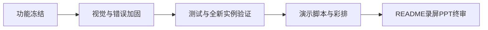
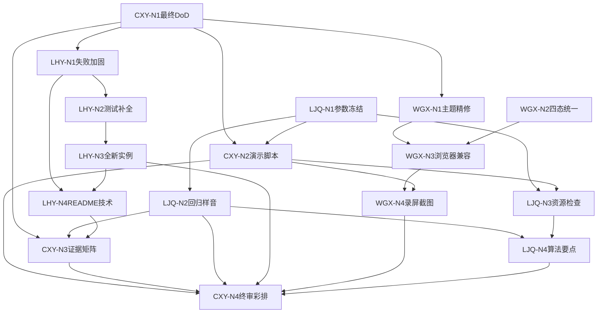

# Week 4 节点化开发计划：总览

> 本周目标：在冻结功能上完成视觉精修、稳定性加固、测试验证与答辩交付；不再扩展主要功能。  
> 工作方式：四人沿独立节点链推进，在最终验收、录屏彩排和 Demo 冻结处汇合。

## 1. 三个协作指标

每个节点必须回答：

1. **哪些人的工作会影响我？**  
   只描述上游依赖，不写时间：
   - 无依赖：可独立开始；
   - 软依赖：可先工作，收到结果后对齐；
   - 硬依赖：必须收到指定交付物才能继续。

2. **我需要交付什么内容？**  
   必须是可检查的代码、页面、真实音频、JSON、日志、测试或文档。

3. **谁需要等待我完成该工作？**  
   写明接收人和用途；没有下游时写“无”。

节点状态沿用 Week 1–3：未开始、可开始、进行中、待交接、已完成、阻塞。

### 执行节奏与容量

- 单个节点预计不超过 **1.5 人日**；视觉精修超过 1 人日立即停止扩展，只保留信息层级和可用性。
- Week 4 前半周并行完成失败加固、测试、视觉和材料草稿；后半周只做全新实例验证、录屏、彩排与阻断修复。
- README、算法边界和演示脚本可先起草，收到最终测试证据后再定稿，不应串行等待所有研发工作完成。
- 答辩前 48 小时冻结主功能；答辩前 24 小时内至少完成一次资源检查和短句冒烟。

## 2. 四人独立执行文件

- [CXY Nodes.md](CXY%20Nodes.md)：最终 DoD、演示脚本、功能—证据矩阵、已知限制与终审。
- [LJQ Nodes.md](LJQ%20Nodes.md)：演示参数冻结、最终回归样音、答辩前资源检查、算法边界说明。
- [LHY Nodes.md](LHY%20Nodes.md)：典型失败处理、测试补全、全新实例验证、README 技术说明。
- [WGX Nodes.md](WGX%20Nodes.md)：主题精修、四态统一、浏览器兼容、录屏支持与终稿截图。
- [GPU Environment Baseline.md](../GPU%20Environment%20Baseline.md)：答辩前 GPU/环境对照。

## 3. 工程主流程



最终演示链路（10 步，与总计划一致）：

```text
1. 打开应用 → 顶栏/侧栏/环境状态
2. 音频页：上传、裁剪、切分、ASR
3. 选 3–10 秒片段 → 音色页，校对参考文本
4. 生成试听 → 保存音色
5. 合成页：选音色、输入固定文本、中性合成
6. 有合法情绪样本时演示一次手动切换；否则说明置灰
7. 结果页：播放、下载、查看历史
8. 历史复用 → 回填合成页
9. 重启应用 → 音色与历史仍在
10. 说明边界：零样本档案、换参考情绪、未做训练/解耦/水印/公网分享
```

答辩前 **48 小时** 停止加功能，只修演示阻断级缺陷。

## 4. 四条节点链

```text
CXY：CXY-N1 最终DoD与验收清单
  ├→ CXY-N2 演示脚本与应急预案 ─┐
  └→ CXY-N3 功能证据矩阵与限制 ─┴→ CXY-N4 终审彩排与签字

LJQ：LJQ-N1 演示参数冻结
  ├→ LJQ-N2 最终回归样音 ─┐
  └→ LJQ-N3 答辩前资源检查 ─┴→ LJQ-N4 算法边界与答辩要点

LHY：LHY-N1 典型失败处理加固
  ├→ LHY-N2 测试补全与标记 ─→ LHY-N3 全新实例全流程验证
  └→ LHY-N4 README技术说明（先起草，收到验证证据后定稿）

WGX：WGX-N1 主题与布局精修 ─┐
     WGX-N2 四态统一 ─────────┴→ WGX-N3 浏览器兼容
  → WGX-N4 录屏支持与终稿截图
```

## 5. 跨角色依赖



避免循环等待：

- CXY-N1 先给出最终 DoD 与五类典型失败清单。
- WGX 视觉精修不阻塞 LHY 错误处理，可并行。
- LHY-N3 全新实例验证是 CXY-N4 的硬依赖。
- LJQ-N1 演示参数冻结后，回归样音与演示脚本才定稿。
- LJQ-N2 回归样音与 LJQ-N3 资源检查并行；资源检查按答辩时间触发，不等待全部回归完成。
- WGX 主题精修与四态统一可并行，二者完成后再做浏览器兼容。
- 答辩前 48 小时起，CXY 统一管理 Demo 冻结与应急降级。

## 6. 关键交接

| 交接物 | 发出 → 接收 | 触发的下游工作 | 用途 |
|---|---|---|---|
| 最终 DoD 与验收清单 | CXY-N1 → 全员 | LHY-N1、WGX-N1 | 范围冻结 |
| 演示参数包 | LJQ-N1 → CXY/WGX | CXY-N2、LJQ-N2 | 固定演示音色/文本 |
| 8–10 分钟演示脚本与分镜 | CXY-N2 → WGX/LJQ | WGX-N4、LJQ-N3 | 录屏与彩排 |
| 五类失败加固结果 | LHY-N1 → CXY | CXY-N4 | 典型错误验收 |
| pytest 与 GPU 测试报告 | LHY-N2 → CXY | CXY-N3/N4 | 质量证据 |
| 全新实例验证记录 | LHY-N3 → CXY | CXY-N4 | 稳定性证据 |
| README 技术章节 | LHY-N4 → CXY | CXY-N3 | 文档一致性 |
| 最终回归 WAV 包 | LJQ-N2 → CXY | CXY-N3/N4 | 听测与答辩备用 |
| 浏览器兼容结果 | WGX-N3 → CXY | CXY-N4 | 播放/下载证据 |
| 终稿截图与录屏素材 | WGX-N4 → CXY | CXY-N4 | 答辩材料 |
| 功能—证据矩阵与已知限制 | CXY-N3 → 全员 | 答辩口径统一 | 不夸大能力 |

## 7. AI 使用规则

- 提示词使用前补充实际路径、版本、已知限制和真实截图。
- AI 可起草 README、PPT 和脚本，但负责人必须对照真实功能审查。
- 不上传未经授权声音、密钥、个人信息或 `.env`。
- 不执行来源不明的安装、删除或模型下载命令。
- 不允许 AI 生成假的测试通过、假 WAV 或夸大指标文案。

## 8. 阶段 Demo 与终审

1. 停止旧服务，启动**全新实例**，完整走通 10 步演示链路。
2. 展示四页视觉与展示稿一致的主要元素（侧栏高亮、卡片、四态）。
3. 运行相关 pytest；GPU 测试与普通单测分开标记并记录。
4. 人工触发五类典型失败，确认提示真实可读。
5. 在目标浏览器验证 WAV 播放与下载。
6. 播放最终回归样音（或对照 Week 3 回归包）。
7. 完成 8–10 分钟彩排：一人主讲，其余人补证据与应急。
8. 提交 README、演示视频、PPT；内容与现场功能一致。
9. 答辩前 48 小时冻结 Demo；此后只修演示阻断缺陷。

验收：

- [ ] 相关 pytest 通过，GPU 测试独立标记。
- [ ] 全新服务实例完整走通一次。
- [ ] Windows 目标浏览器可播放和下载 WAV。
- [ ] 未授权、音频无效、ASR 失败、模型未加载、显存不足/超时有明确提示。
- [ ] 四页四态完整；环境状态不是第五页。
- [ ] README、视频、PPT 与实际功能一致；已知限制完整。
- [ ] 功能—证据矩阵每项有真实文件/日志/截图支撑。
- [ ] 答辩前 48 小时无新增主功能。

## 9. 本阶段不做

- 不增加主功能、新页面、FastAPI、数据库或第二套前端。
- 不训练权重、不做模型级解耦、不恢复水印/SaaS/积分。
- 不把自动情绪分类升级为正式 DoD。
- 不用预跑 WAV 代替正常阶段验收（现场 OOM 降级除外，须口头说明）。
- 不在 README/PPT/答辩中夸大相似度、情绪准确率或解耦能力。
- Gradio 视觉若超过 1 人日仍不稳定：保信息层级与交互，不换技术栈。

## 10. GPU 与环境（40 系 / 50 系）

- 真值文档：[GPU Environment Baseline.md](../GPU%20Environment%20Baseline.md)
- LJQ-N3 答辩前核对：驱动、PyTorch、模型路径、显存空闲。
- 主 Demo 机选定后写入演示参数包；备用机保留同版本回归 WAV。
- 现场 OOM 可播放同版本预跑 WAV，但必须说明降级；资源允许时再现场生成一条短句。
