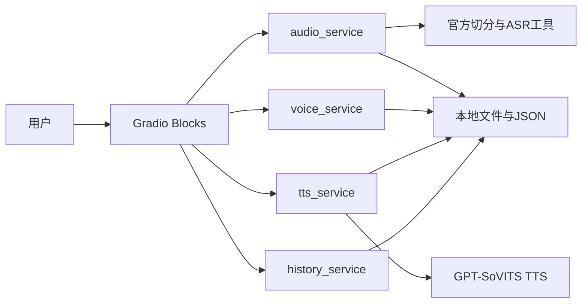

# 简化语音克隆平台统一方案

> 本文是项目范围、产品流程和技术实现的统一真值。  
> 团队规模：4 人学生团队；交付周期：4 周；目标环境：本地 Windows GPU。  
> 页面展示稿中的 2×2 仅用于在一张图中展示四个页面，运行时必须是“侧栏一项对应一个完整页面”。

---

## 0. 方案结论

本项目不大规模修改 GPT-SoVITS，不训练新的音色—韵律解耦模型，也不建设完整 SaaS 平台。

最终方案为：

```text
Gradio Blocks 页面
→ Python services 业务函数
→ GPT-SoVITS 官方推理、切分与 ASR 能力
→ 本地文件夹和 JSON 索引
```

- 一个 `app.py` 启动本地网页。
- 不使用 Vue、FastAPI、数据库、Redis 或任务系统。
- 使用 GPT-SoVITS 零样本克隆：保存参考音频、参考文本和配置，不训练 `.ckpt` / `.pth`。
- 情绪控制来自同一说话人的不同情绪参考片段，不宣称存在通用情绪旋钮。
- 自动情绪分类只允许作为默认关闭的实验项，不进入 MVP 验收。
- 所有 Demo 必须使用真实推理结果；Mock 仅可用于隔离外部依赖的单元测试。

核心闭环：

```text
导入授权音频
→ 裁剪、切分、ASR 与人工校对
→ 从切分结果选取 3–10 秒片段
→ 生成音色试听
→ 保存零样本音色档案
→ 输入文本并合成
→ 播放、下载、查看或复用历史
```

如果用户已有合格的 3–10 秒参考音频和准确文本，可跳过完整数据处理，直接创建音色。

---

## 1. 产品定位与成功标准

### 1.1 产品定位

面向本地 Windows GPU 的极简语音克隆工具：用户用 3–10 秒授权参考音频创建音色，之后通过“选音色、输入文本、点击合成”三步生成语音。

卖点是：**极简零样本克隆 + 可解释的参考音频情绪控制**。

### 1.2 “极简使用”的可验收定义

- 已有音色时：选音色 → 输入文本 → 点击合成，三步出声。
- 首次创建音色时：允许走完整数据处理流程，也允许直接上传短参考音频。
- 每个页面只展示当前任务需要的控件；语速与停顿放入默认折叠的“高级设置”。
- 用户错误显示可理解的原因和下一步；技术堆栈写入日志，不直接暴露给普通用户。

### 1.3 MVP 成功标准

1. 一个命令可启动 Gradio 本地网页。
2. 顶栏、左侧四项导航和侧栏底部环境状态正常显示。
3. 点击导航时，右侧主区只显示对应的一个完整页面。
4. 真实授权音频可裁剪、切分、ASR，并导出合法四字段 `.list`。
5. 可从最近数据集选择 3–10 秒切片并自动带入 ASR 文本；也可直接上传短参考音频。
6. “生成音色”可产生真实试听；只有试听成功才可“保存音色”。
7. 音色档案保存后立即出现在合成页，重启应用后仍可加载。
8. 同一音色可连续完成 3 次真实合成。
9. 合成结果可播放、下载 WAV、查看历史和复用参数。
10. 合成成功后可切换到结果页；历史复用可回填合成页。
11. 中性情绪必须可用；其他情绪缺少合法参考样本时必须置灰或隐藏。
12. 失败不产生成功历史，不使用假音频、假权重或假进度。

本期不承诺“音色相似度 90%”“情感识别准确率 80%”等无固定数据集、基线和评价方法的数字。

---

## 2. MVP 范围

| 领域 | 必须做 | 可选加分 | 本期不做 |
|---|---|---|---|
| 页面 | 顶栏、侧栏四页、浅色紫蓝主题、四态反馈 | 小范围响应式优化 | Vue/React、四页 2×2 同屏 |
| 数据 | 上传授权、裁剪、标准化、官方静音切分、ASR、`.list` | 允许人工粘贴/校对文本 | 专业 DAW、默认降噪、人声分离 |
| 音色 | 3–10 秒零样本档案、真实试听、保存与重启恢复 | 合法预置音色 | 少样本训练、独立 Speaker Embedding 权重 |
| 情绪 | 中性；有 `emotion_refs` 时手动切参考 | 自动文本分类建议，默认关闭 | 通用强度旋钮、模型级情绪控制 |
| 韵律 | `speed_factor`、`fragment_interval` 小范围调节 | 简单时长/F0 对照 | 自研 F0/能量网络、GRL 解耦 |
| 结果 | WAV 播放/下载、历史、复用、删除 | FFmpeg 验证通过后显示 MP3 | 公网分享链接 |
| 存储 | 本地文件夹、原子 JSON 索引、损坏重建 | — | SQLite、云存储 |
| 系统 | Gradio 单体、单任务串行、真实日志 | — | FastAPI、并发队列、多 GPU 调度 |
| 安全 | 授权确认、路径限制、真实错误 | — | 水印、敏感词、生成检测、用户权限 |

MVP 验收只保证 WAV。MP3 即使实现，也只算可选加分；未验证时隐藏入口。

---

## 3. 技术架构

### 3.1 调用关系



唯一运行路径：

- 页面事件直接调用本地 Python services。
- `tts_service.py` 在进程内封装官方 `TTS.py`。
- `api_v2.py` 仅用于核对参数，不是运行时依赖，也不再包一层本项目 API。
- 长任务使用 Gradio `queue()`、真实进度和禁用重复提交；本期一次只执行一个 GPU 任务。

### 3.2 建议目录

```text
Project/
├─ app.py                         # 唯一启动入口
├─ ui/
│  ├─ layout.py                  # 顶栏、侧栏、页面显隐、共享状态
│  ├─ audio_page.py
│  ├─ voice_page.py
│  ├─ tts_page.py
│  └─ result_page.py
├─ services/
│  ├─ audio_service.py           # 校验、裁剪、标准化、切分、ASR
│  ├─ voice_service.py           # 试听、保存、索引、删除
│  ├─ tts_service.py             # GPT-SoVITS 推理适配
│  └─ history_service.py         # 结果历史、复用、删除、重建
├─ models/
│  └─ schemas.py
├─ assets/
│  ├─ theme.css
│  ├─ preview_prompt.txt         # 固定试听文本
│  └─ authorized_presets/        # 只放有授权的预置音色
├─ data/
│  ├─ uploads/
│  ├─ datasets/
│  ├─ voices/
│  ├─ outputs/
│  └─ index/
│     ├─ voices.json
│     └─ history.json
├─ tests/
├─ requirements.txt
└─ README.md
```

真实人声、生成音频和模型权重默认不提交 Git。

### 3.3 上游复用边界

优先复用：

- `tools/slice_audio.py`、`tools/slicer2.py`
- `tools/asr/funasr_asr.py` 或 `tools/asr/fasterwhisper_asr.py`
- `GPT_SoVITS/TTS_infer_pack/TTS.py`
- `GPT_SoVITS/configs/tts_infer.yaml`

SenseVoice 通过官方 FunASR 路径选择。不得把官方大段源码复制到 `Project/`，不得修改推理核心以赶进度。

---

## 4. 前端展示与开发流程

### 4.1 展示稿解释（冻结）

展示稿中的四个象限代表四个独立页面，不代表运行时布局。

```text
┌────────────────────────────────────────────────────────┐
│ AI 音频生成                 [帮助] [设置] [本地用户]      │
├──────────────┬─────────────────────────────────────────┤
│ ● 音频数据处理 │                                         │
│   音色样本克隆 │          当前选中的完整页面                │
│   文本生成语音 │                                         │
│   合成结果管理 │                                         │
│              │                                         │
│ 环境状态      │  ← 非导航项                              │
└──────────────┴─────────────────────────────────────────┘
```

- 导航只有四项，当前项高亮；默认进入“音频数据处理”。
- 环境状态显示模型、FFmpeg、ASR、音色数和历史数，不是第五页。
- 顶栏“帮助”展示推荐流程与限制；“设置”展示本地环境和授权说明；用户区只显示“本地用户”。
- “剩余点数”“充值”、真实登录和多用户功能不实现。
- 页面可使用侧栏 `gr.Radio` 或按钮组控制四个 `gr.Group(visible=...)`。
- `gr.State` 保存当前页面、最近数据集、当前音色和当前结果等会话状态。

### 4.2 页面一：音频数据处理

展示内容：

1. 拖拽或点击上传 WAV、MP3、FLAC、M4A。
2. 授权确认、文件名、时长、采样率、声道和基础波形。
3. 起止时间、重置、预览裁剪、确认裁剪并标准化。
4. 切分列表：片段名、起止时间、时长、播放、选择。
5. 转写预览：时间戳和可编辑文本。
6. 导出数据集，并可将选中片段送入“音色样本克隆”页。

展示稿可沿用“VAD 切分列表”标题，但副标题必须说明：本项目使用官方静音/音量阈值切分，FunASR 内部可能使用 VAD；不是自研 VAD。

数据处理流程：

```text
标准化音频
→ 官方静音阈值切分
→ ASR 批量转写
→ 人工抽检与修正
→ 生成 dataset.list 和 dataset.json
```

至少抽检 20 条或总切片的 10%，取较大值；总切片不足 20 条则全部抽检。

### 4.3 页面二：音色样本克隆

输入来源有两种：

- 从最近数据集选择 3–10 秒切片，自动带入其 ASR 文本，用户校对；
- 直接上传 3–10 秒参考音频并手工填写准确文本。

创建表单：

- 音色名称、说话人代号、参考音频、参考文本、语种、授权确认。
- 中性参考必填。
- “高级：追加情绪样本”仅在有同一说话人的合法 happy/sad 等片段时启用，每个情绪样本必须有对应文本。

按钮语义必须分开：

1. **生成音色**：校验并用固定试听文本执行一次真实零样本推理；只生成预览，不写正式档案。
2. **保存音色**：仅在试听成功后启用；复制文件并写 `voice.json` 和全局 `voices.json`。

已有音色使用卡片墙展示名称、说明、试听和选中态。“温柔女声”等角色音色只有存在明确授权素材时才允许显示；否则显示空状态和“添加音色”。

### 4.4 页面三：文本生成语音

- 文本框，显示 `0/500`；500 字是演示环境的可配置保护上限，不是模型极限。
- 语种选择。
- 音色下拉读取 `data/index/voices.json`，文件缺失或校验失败的音色不得出现。
- 默认情绪胶囊：中性、开心、悲伤。中性必有；其他标签无真实 `emotion_refs` 时置灰。
- 愤怒、惊讶仅在对应样本存在时额外显示。
- 高级设置默认折叠，只含安全范围内的语速和停顿。
- 合成按钮提交后禁用重复点击，显示真实排队/执行状态。
- 成功后保存 WAV 与历史，并切换到“合成结果管理”；失败只写错误日志，不写成功历史。

自动情绪分类如有时间可作为实验开关：

```text
输入文本
→ 分类建议标签与置信度
→ 有对应情绪参考则选用
→ 低置信度、缺参考或分类失败则回退 neutral
→ 用户始终可手动覆盖
```

UI 必须标明“实验功能”，默认关闭，不作为任何周 DoD。

### 4.5 页面四：合成结果管理

- 当前结果：波形、播放/暂停、进度、时长。
- 快捷操作：播放、下载 WAV、“分享”。
- “分享”仅导出本地文件，不生成公网链接。
- 历史按时间倒序，显示文本摘要、音色、情绪、语速、时长和创建时间。
- 每条历史支持播放、下载、复用、删除。
- “复用”切回合成页并回填文本、音色、情绪和高级参数。
- “清空记录”必须二次确认；不得静默删除。

### 4.6 跨页状态

| 触发 | 跨页结果 |
|---|---|
| 音频页选择切片并“用于克隆” | 切到音色页，带入音频路径与 ASR 文本 |
| 保存音色成功 | 刷新音色卡片和合成页下拉 |
| 合成成功 | 切到结果页并显示当前 WAV |
| 历史点击“复用” | 切到合成页并回填原参数 |
| 删除音色或结果 | 同步更新全局索引和相关页面 |

---

## 5. 数据契约

### 5.1 数据集清单

```text
DatasetManifest:
  dataset_id
  source_audio
  authorized
  sample_rate
  created_at
  segments[]:
    segment_id
    path
    start
    end
    duration
    transcript
    checked
```

`.list` 每行四字段：

```text
音频路径|说话人名称|语种|转写文本
```

### 5.2 音色档案

```json
{
  "voice_id": "voice_xxx",
  "name": "我的音色 01",
  "speaker": "spk_xx",
  "reference_audio": "reference.wav",
  "prompt_text": "与参考音频一致的文本",
  "prompt_lang": "zh",
  "emotion_refs": {
    "neutral": {"path": "reference.wav", "text": "中性参考文本"},
    "happy": {"path": "refs/happy.wav", "text": "开心参考文本"}
  },
  "preview_audio": "preview.wav",
  "authorized": true,
  "created_at": "ISO-8601"
}
```

- 单个档案：`data/voices/{voice_id}/voice.json`。
- 全局索引：`data/index/voices.json`。
- 保存和删除均由 `voice_service` 原子更新全局索引；启动时校验并可从目录重建。

### 5.3 合成记录

```text
GenerationRecord:
  result_id
  voice_id
  text
  text_lang
  emotion
  speed_factor
  fragment_interval
  output_wav
  duration
  created_at
  status
  error
```

全局历史：`data/index/history.json`。失败记录可保留错误日志，但不得标记为成功或出现在成功结果列表。

---

## 6. 四周实施计划

每周最后一天只允许集成、修复阻断 Demo 的问题和收集证据，不合并新功能。

统一容量规则：单个节点原则上不超过 1.5 人日；周三中午前交付最小可集成产物，周四预演，周五只修阻断问题。阻塞超过半天必须结对或触发降级，不能等到周末才暴露。

### Week 1：Baseline & Pipeline

目标：官方引擎真实出声，Gradio 页面壳和服务契约成立。

- 算法：锁定实际 GPT-SoVITS 目录/版本、Python、PyTorch、CUDA、GPU；官方零样本连续生成 3 条 WAV；完成一次切分与 ASR。
- 后端/业务：建立 `services/`、`schemas.py`、日志和 `app.py`；确定进程内 `TTS.py` 调用路径。
- 前端：完成 `layout.py`、顶栏、侧栏四项、环境状态、四页空状态、基本紫蓝主题和页面显隐。
- 评测文档：授权清单、5 条回归文本、1 条试听文本、契约草案和验收表。

DoD：

- [ ] 3 条本机真实 WAV 可播放。
- [ ] 主 Demo 机至少 1 条真实 WAV；实际存在的每种 GPU 环境轨道至少各有 1 条本轨道 WAV 与日志，不强制所有成员重复运行 GPU 推理。
- [ ] 一组真实切分和 ASR 输出。
- [ ] `app.py` 可打开本地网页；侧栏四项可切换且主区一次一页。
- [ ] `services` 函数签名、数据字段和错误对象形成草案。
- [ ] 冻结 GPT-SoVITS 主版本、页面信息架构和导航文案。

如果只有官方 WebUI 出声而项目页面尚未调用成功，Week 1 记为“部分通过”，不得写成完整闭环。

### Week 2：Audio & Voice

目标：跑通“音频进入系统 → 生成试听 → 保存音色”。

- 音频页：上传、授权、校验、裁剪、标准化、切分、ASR、转写编辑和 `.list`。
- 音色页：从最近数据集选片并带入文本；直接上传短参考；生成试听；保存档案；卡片墙。
- services：原子写 `voice.json`/`voices.json`，处理非法文件和重启恢复。
- Week 2 保存第一个音色前，冻结数据契约。
- 开发顺序优先保证“合法短参考 → 真实试听 → 保存音色 → 重启恢复”；完整音频处理与跨页带入并行接入，避免音色主链路硬等待切分/ASR 全部完成。

DoD：

- [ ] 一份合法 `dataset.list` 与 `dataset.json`。
- [ ] 一次浏览器操作完成音频页到音色页跨页带入。
- [ ] 至少一个真实 `preview.wav`、`voice.json` 和更新后的 `voices.json`。
- [ ] 重启后音色仍在。
- [ ] 过短、过长、文本为空、未授权等失败有明确提示。

本周不要求合成页和结果页完成。

### Week 3：TTS, Results & Emotion

目标：完成产品闭环和最小双条件对照。

- 合成页：文本、语种、音色、情绪胶囊、高级设置、真实进度、防重复提交。
- 结果页：当前结果、WAV 下载、历史、复用、删除与清空确认。
- 跨页：保存音色刷新下拉；合成成功切结果页；复用回填。
- 情绪：中性必做；有合法多情绪参考时，由 `voice_service.add_emotion_reference` 写入档案后接手动切换；缺少素材或写入链路未完成时置灰。
- 轻量对照：固定音色和文本，只改变参考情绪或语速/停顿，记录“明显/较弱/无效/音色漂移”。

DoD：

- [ ] 5 条固定文本各有真实回归结果，其中至少 3 条在同一服务实例中连续成功。
- [ ] 合成成功、自动切页、历史写入和复用回填完整。
- [ ] 中性稳定可用；无情绪样本时按钮正确置灰。
- [ ] 有合法样本时至少一组情绪对照；没有样本则不阻断 MVP。
- [ ] 自动情绪分类不作为通过条件。

Week 3 结束后冻结主功能，只修问题。

### Week 4：Polish, Test & Delivery

目标：在冻结功能上完成视觉、稳定性和答辩材料。

- 按展示稿精修浅色紫蓝主题、卡片、按钮、侧栏高亮、间距和四态。
- 处理文件缺失、ASR 失败、模型未加载、显存不足和超时。
- 停止旧服务后启动全新实例，执行单元、集成和人工浏览器测试。
- 完成 README、操作说明、已知限制、10 分钟演示脚本、录屏和 PPT。

DoD：

- [ ] 相关 pytest 通过，GPU 测试与普通单测分开标记。
- [ ] 全新服务实例完整走通一次。
- [ ] Windows 目标浏览器可播放和下载。
- [ ] 五类典型失败有明确提示。
- [ ] 答辩前 48 小时冻结 Demo，只修演示阻断级缺陷。

---

## 7. 团队分工

### CXY：范围、数据、评测与文档

- 对范围、契约冻结、每周 Demo 和最终验收负责。
- 维护授权清单、固定文本、听测表、风险表和功能—证据矩阵。
- 编写 README、演示脚本、录屏分镜与答辩 PPT。
- 禁止把计划功能写成已实现，禁止恢复训练、水印和 SaaS 功能。

### LJQ：算法与引擎适配

- 跑通 GPT-SoVITS、切分、ASR 和零样本推理。
- 提供 `tts_service` 调用参数、失败条件和推荐默认值。
- 定义参考音频质量要求、情绪映射和轻量对照实验。
- 不修改核心模型，不承诺模型级解耦或准确率百分比。

### LHY：Python 业务与持久化

- 实现 services、schemas、文件校验、路径限制、日志和原子 JSON。
- 负责 `app.py` 启动集成、Gradio queue 和失败不写成功记录。
- 编写非 GPU 单元测试。
- 不增加 FastAPI、数据库或另一套任务系统。

### WGX：Gradio 页面与体验

- 按展示稿实现顶栏、侧栏和四个独立页面。
- 负责页面显隐、共享状态、跨页刷新/跳转/回填和浏览器测试。
- 使用 Gradio 主题与 `theme.css` 对齐视觉。
- 不做 2×2 同屏、积分充值、真登录或未授权音色。

### 协作纪律

1. Week 1 周中完成一次契约对齐，Week 2 首次保存音色前定稿。
2. 每周四做集成预演；周五不合并新功能，只修阻断项并验收。
3. 一次只运行一个 GPU 重任务，由 LJQ 维护使用顺序。
4. 交叉帮助不改变主责；主责人必须能解释和验收自己的产物。

---

## 8. 测试与质量

### 8.1 单元测试

- 文件类型、大小、时长、授权和路径校验。
- 裁剪起止边界、标准化、安全文件名。
- `.list` 四字段和 `dataset.json`。
- `voice.json`、`voices.json`、`history.json` 原子读写、排序、删除和重建。
- 文本空值/长度、语速/停顿范围、缺少情绪参考。
- 失败推理不产生成功记录。

文件大小上限应在 Week 1 根据本机资源冻结并写入 `schemas.py` 和 README，不在文档中猜测。

### 8.2 真实集成测试

- 模型加载、切分和 ASR。
- 同一音色连续 3 次推理。
- 从数据集选片到保存音色的跨页流程。
- 保存音色后合成页即时刷新。
- 合成后结果页、历史、复用与重启恢复。
- 输出 WAV 在目标浏览器可播放。

### 8.3 人工听测

固定 5 条公开、安全文本，记录：

- 可懂度；
- 明显杂音；
- 断句；
- 音色主观接近程度；
- 情绪变化是否可感知；
- 是否失真或音色漂移。

只使用“明显、较弱、无效、失真”等结论，不伪造百分比。

每次代码修改后运行相关测试；推理相关修改至少生成一个真实 WAV；验证前停止旧服务并启动全新实例。

---

## 9. 风险与降级

| 风险 | 触发条件 | 降级方案 |
|---|---|---|
| 官方模型无法出声 | Week 1 周三仍无 1 条真实 WAV | 停止页面精修，集中处理环境；Week 1 记部分通过 |
| 音频页→音色页断链 | Week 2 周三仍不能带入片段和文本 | 保留直接上传短参考的路径，跨页功能继续修复但不伪造 |
| 情绪效果不明显 | 对照被评为无效或音色漂移 | 主 Demo 只展示中性；如实记录限制 |
| 没有合法多情绪素材 | Week 3 前仍未获得 | 开心/悲伤置灰；不阻断 MVP |
| 自动分类不准/装不上 | 超过半天仍失败或频繁误判 | 关闭并隐藏实验入口 |
| ASR 不可用 | 模型下载失败或转写严重错误 | 用户手工输入/校对文本，Demo 使用已校对素材 |
| 显存不足或超时 | OOM 或短句超过约定时间 | 单任务串行、关闭其他模型进程、缩短文本 |
| JSON 损坏 | 启动读取失败 | 使用备份或从目录重建，不清空用户数据 |
| Gradio 视觉受限 | 精修超过 1 人日仍不稳定 | 保留信息层级和交互，不切换前端技术栈 |
| 时间不足 | 周四仍无法串起当周 DoD | 保留顺序：中性合成 → 音色重启 → 历史 → 手动情绪 → 自动分类 → 美化 |
| 展示稿理解错误 | 实现出现四页 2×2 同屏或第五导航项 | 立即改回侧栏四项 + 单页主区 |

每周 Demo 必须现场运行真实链路，预跑 WAV 不能代替周验收。最终答辩若现场 OOM，可播放同版本预跑 WAV，但必须明确说明降级；资源允许时，再现场生成一条短句证明链路仍可运行。

---

## 10. 最终演示流程

1. 打开应用，展示顶栏、四项侧栏和环境状态。
2. 在音频页上传授权音频，裁剪并展示切分/ASR。
3. 选择 3–10 秒片段并送入音色页，校对参考文本。
4. 点击“生成音色”播放真实试听，再点击“保存音色”。
5. 切到合成页，选择刚保存的音色，输入固定文本并合成。
6. 有合法情绪样本时展示一次手动情绪对照；否则说明按钮置灰原因。
7. 在结果页播放、下载并查看历史。
8. 点击历史“复用”，验证参数回填。
9. 重启应用，展示音色和历史仍存在。
10. 主动说明：本期是零样本档案；情绪来自换参考音频；未做训练、模型级解耦、水印或公网分享。

---

## 11. 最终验收清单

### 环境与架构

- [ ] 一个 `app.py` 启动 Gradio，本项目没有 FastAPI/Vue/数据库。
- [ ] 实际 Python、PyTorch、CUDA、GPU 和 GPT-SoVITS 版本已记录。
- [ ] FFmpeg、模型和至少一种 ASR 状态可见。

### 页面

- [ ] 顶栏 + 四项侧栏 + 单页主区；环境状态不是第五页。
- [ ] 四页对齐展示稿内容，未实现积分、充值或真登录。
- [ ] 空、加载、成功、失败状态明确。
- [ ] 页面切换、跨页带入、音色刷新、结果跳转和历史复用正常。

### 数据与音色

- [ ] 上传、授权、裁剪、标准化、切分、ASR 和四字段 `.list` 可用。
- [ ] 可从最近数据集选择片段，也可直接上传短参考。
- [ ] “生成音色”只生成试听；试听成功后才可保存。
- [ ] `voice.json` 与 `voices.json` 正确且重启可恢复。

### 合成与结果

- [ ] 中性音色可连续 3 次真实合成。
- [ ] 情绪标签只在对应参考片段存在时启用。
- [ ] WAV 可播放、下载、查看历史和复用。
- [ ] 分享未伪装成公网链接；清空历史需确认。

### 质量与文档

- [ ] 相关单元和真实 GPU 测试通过。
- [ ] 全新实例完整走通。
- [ ] 未使用假音频、假权重或假进度。
- [ ] README、演示和 PPT 与实际功能一致，已知限制完整。

---

## 12. 参考依据

- GPT-SoVITS 官方项目：<https://github.com/RVC-Boss/GPT-SoVITS>
- 本地参考实现：`Reference-Project/GPT-SoVITS-main/` 或 Week 1 确认的实际版本目录
- Gradio Blocks：<https://www.gradio.app/docs/gradio/blocks>
- Gradio 主题：<https://www.gradio.app/guides/theming-guide>
- 情绪参考切换思路：<https://github.com/2DIPW/gpt_sovits_infer_with_emotion>（仅借鉴思路，不整仓引入）

凡未产生真实音频、文件、测试或日志的能力，一律不得写成“已实现”。
