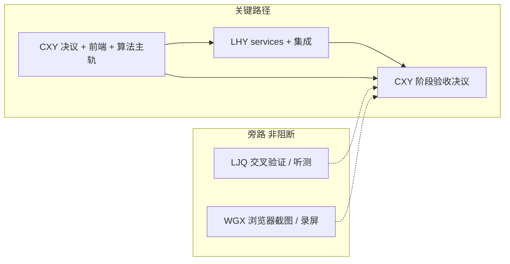

# 团队计划 v2：CXY 主导 + 单点决策

> 版本：v2.0  
> 生效日期：2026-09-03  
> 决策人：CXY  
> 取代内容：v1 的「四人对等四条链 + 三方确认」协作模式  
> 适用范围：Week 1–4 全部节点安排与协作方式；不改变产品范围真值（`newplan.md`）

---

## 1. 为什么改

v1 假设四人对等投入、每周各 4 个节点。实际情况：

- **WGX、LJQ 其他事务较多**，无法承担主力开发与关键路径。
- **CXY 已实际承担跨角色工作**（例：`env/LJQ-baseline.md` 由 CXY 在本机代跑，GPU 也在 CXY 机器上）。
- 四人重度使用 AI 工具，**人对人的讨论成本高于人对 AI 的成本**，多方确认环节成为纯损耗。

v2 的两条原则：

1. **关键路径只留两条**：CXY（核心开发 + 决策）与 LHY（Python 业务与集成）。
2. **能由 CXY 审查拍板的事，不进入讨论**。LJQ、WGX 只接收结论、只交证据。

---

## 2. 新角色模型

| 角色 | 定位 | 负责范围 | 每周节点数 | 是否在关键路径 |
|---|---|---|---:|---|
| **CXY** | 核心开发 + 唯一决策者 | 范围与契约决议、Gradio 前端、算法主轨（环境/GPT-SoVITS/参数）、验收与文档 | 5–6 | **是** |
| **LHY** | Python 业务与集成（负载不变） | services、schemas、原子 JSON、`app.py` 集成、非 GPU 测试 | 4 | **是** |
| **LJQ** | 轻量算法辅助（大幅减负） | 备用环境交叉验证、授权素材、人工听测 | 1–2 | 否（旁路） |
| **WGX** | 轻量交付辅助（大幅减负） | 浏览器冒烟截图、录屏素材、PPT 素材 | 1–2 | 否（旁路） |

### 2.1 CXY 吸收了哪些原属他人的工作

| 原归属 | 工作 | 现归属 |
|---|---|---|
| WGX | `layout.py`、四页页面、显隐切换、`gr.State`、主题 | **CXY** |
| LJQ | 本机环境打通、GPT-SoVITS 运行、TTS/切分/ASR 基线、参数与情绪规则 | **CXY** |

> **负载提示（如实记录）**：本安排会显著提高 CXY 的实际工作量。对应的减压手段写在 §5「CXY 减压机制」，不通过降低验收标准来实现。

### 2.2 LHY 保持原工作量

LHY 的四个节点链与 v1 一致：服务实现 → 持久化 → 失败隔离 → 集成。唯一变化是**上游只有 CXY 一个人**，不再等 LJQ 的算法交接和 WGX 的 UI 交接。

### 2.3 LJQ / WGX 的减负原则

三条硬规则：

1. **不进关键路径**：他们的节点不作为任何人的硬依赖。
2. **不需要来回对接**：任务自包含，输入是已发布的决议文件，输出是文件或截图。
3. **缺席即兜底**：未按期交付时，由 CXY 自行补齐并在决议台账记一行，**不阻断主线、不追责讨论**。

---

## 3. 单点决策机制（取消多方确认）

### 3.1 决议流程

```text
CXY 起草 → CXY 审查 → CXY 拍板 → 写入决议台账 → 广播链接
                                          ↓
                            LJQ / LHY / WGX 只读并执行
```

- **发布即生效**。取消 v1 的「三名接收人确认后节点才算完成」。
- 无需回复「已接收」。默认视为已知悉。

### 3.2 异议处理

- 异议**只能以单条书面问题**提出（一句话问题 + 一句话影响）。
- CXY 在 **24 小时内**书面裁定，写入台账。
- **不开会、不群聊讨论、不多轮往返**。裁定即终结。

### 3.3 交接格式（唯一允许的形式）

```text
[节点ID] 产物路径 + 一行说明 + 已知限制
```

禁止：口头「做好了」、截图代替路径、需要对方追问才能理解的交付。

### 3.4 决议台账

所有范围、契约、验收结论、降级决定记录在：

`Project/Documents/Decisions.md`

台账是唯一真值。文档与台账冲突时以台账为准。

---

## 4. 新节点分配总表

### Week 1 — 基线与工程壳

| 角色 | 节点 |
|---|---|
| CXY | N1 范围与 DoD 冻结 · N2 契约 v0.1 与授权资产 · N3 本机环境打通 · N4 官方基线（WAV + 切分/ASR） · N5 Gradio 四页壳 · N6 阶段验收决议 |
| LHY | N1 工程骨架 · N2 services 与 schemas · N3 日志/错误/桩函数 · N4 集成与一键启动 |
| LJQ | N1 备用环境记录与交叉验证 |
| WGX | N1 浏览器冒烟与截图归档 |

### Week 2 — 音频与音色

| 角色 | 节点 |
|---|---|
| CXY | N1 契约 v1.0 冻结 · N2 参考音频规范与算法参数 · N3 音频页与音色页 · N4 跨页带入与 State · N5 端到端验收决议 |
| LHY | N1 `audio_service` · N2 `voice_service` 试听与保存 · N3 原子索引与重启恢复 · N4 页面事件集成 |
| LJQ | N1 授权素材与人工听测 |
| WGX | N1 浏览器冒烟与截图归档 |

### Week 3 — 合成与结果闭环

| 角色 | 节点 |
|---|---|
| CXY | N1 契约 v2.0 冻结 · N2 合成参数与情绪映射 · N3 合成页与结果页 · N4 回归与双条件对照 · N5 闭环验收决议 |
| LHY | N1 `tts_service` · N2 `history_service` · N3 失败隔离与历史恢复 · N4 事件集成 |
| LJQ | N1 人工听测与情绪素材 |
| WGX | N1 浏览器冒烟与截图归档 |

### Week 4 — 精修、测试与答辩

| 角色 | 节点 |
|---|---|
| CXY | N1 最终 DoD 与冻结规则 · N2 主题精修与四态统一 · N3 演示参数冻结与最终回归 · N4 证据矩阵与已知限制 · N5 终审彩排与 Demo 冻结 |
| LHY | N1 五类失败加固 · N2 测试补全与 GPU 标记 · N3 全新实例验证 · N4 README 技术说明 |
| LJQ | N1 答辩前资源检查 · N2 最终听测与算法边界复核 |
| WGX | N1 浏览器兼容 · N2 录屏与终稿截图 |

---

## 5. CXY 减压机制

标准不降，但允许以下四种减压：

1. **可外包的机械劳动下放**：跑只读命令、截图归档、听测打分、录屏、素材整理 → 交 LJQ/WGX。这些任务不需要讨论，也不进关键路径。
2. **前端按「结构优先、视觉靠后」推进**：Week 1–3 只保证信息层级与交互正确，视觉精修集中到 Week 4。
3. **算法轨只做「能出声 + 可复现」**：不追求音质调优；参数以官方默认与本机可跑为准。
4. **AI 承担初稿**：契约、页面骨架、测试、文档由 AI 起草，CXY 只做审查与拍板；审查不可省略。

### 5.1 CXY 单周节点上限

- 单节点不超过 **1.5 人日**；超出必须拆分为「最小可验收」+「增强」。
- 同一周 CXY 的节点若超过 6 个，**先砍增强项**，不压缩验收证据。

---

## 6. 关键路径与旁路



- 实线 = 硬依赖，缺失则阻断。
- 虚线 = 补充证据，缺失时 CXY 兜底，只影响证据完备度，不影响是否进入下一周。

---

## 7. GPU 与环境归属调整

| 项 | v1 | v2 |
|---|---|---|
| 主 GPU 轨道 | LJQ | **CXY 本机（RTX 5060 Laptop，Track B）** |
| 环境矩阵维护 | LJQ | **CXY** |
| 备用轨道与交叉验证 | — | LJQ（非阻断） |

- 真值文档仍是 [GPU Environment Baseline.md](GPU%20Environment%20Baseline.md)，但 §6 全组矩阵改由 CXY 维护。
- Week 1 的 P0 阻塞项（PyTorch 未安装、预训练权重缺失、FFmpeg 不可用、ASR 模型缺失）归入 **CXY-N3**，不再等 LJQ。

---

## 8. 与 v1 的差异摘要

| 项 | v1 | v2 |
|---|---|---|
| 节点总数/周 | 14–16 | 11–12 |
| 关键路径 | 四条链汇合 | 两条链（CXY、LHY） |
| 前端主责 | WGX | CXY |
| 算法主责 | LJQ | CXY |
| 决议生效 | 三方确认后 | CXY 发布即生效 |
| 异议方式 | 讨论与对齐 | 书面单条 + 24h 裁定 |
| LJQ/WGX 缺席 | 阻断并需结对 | 不阻断，CXY 兜底 |

---

## 9. 不变的部分

以下内容 **不因本次调整而放宽**：

- 产品范围与四页结构：以 `newplan.md` 为真值。
- 禁止事项：不训练权重、不做模型级解耦、不加 FastAPI/数据库/第二套前端、不做 2×2 同屏。
- 证据要求：不得用 Mock、预跑旧文件、AI 结论或固定成功状态替代真实运行。
- 每周现场 Demo 与阶段结论规则（通过 / 部分通过 / 失败）。

---

## 依据

- 范围真值：[newplan.md](newplan.md)
- 执行计划：[New-Task1. AI Project Execution Plan.md](New-Task1.%20AI%20Project%20Execution%20Plan.md)
- 决议台账：[Decisions.md](Decisions.md)
- 环境真值：[GPU Environment Baseline.md](GPU%20Environment%20Baseline.md)
- 周计划：[Week1](Week1/Week1%20Development%20Guide.md) · [Week2](Week2/Week2%20Development%20Guide.md) · [Week3](Week3/Week3%20Development%20Guide.md) · [Week4](Week4/Week4%20Development%20Guide.md)
