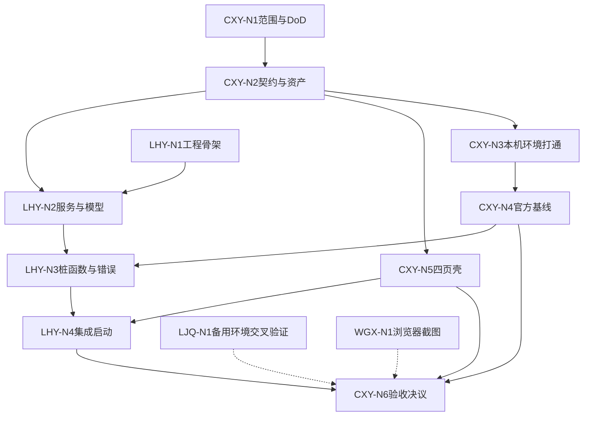

# Week 1 节点化开发计划：总览

> 本周目标：真实模型出声 + Gradio 四页工程壳 + Python services 骨架 + 可执行交接约定。  
> 工作方式：**CXY 与 LHY 两条关键链**并行推进，LJQ/WGX 提供非阻断补充证据，最后由 CXY 单点验收。  
> 协作模式真值：[Team Plan v2 (CXY-Led).md](../Team%20Plan%20v2%20(CXY-Led).md) · 决议台账：[Decisions.md](../Decisions.md)

## 1. 三个协作指标

每个节点必须回答：

1. **哪些人的工作会影响我？**  
   只写启动条件和上游依赖，不写日期或时刻，并区分：
   - 可立即开始：无外部依赖；
   - 软依赖：可先做骨架，收到结果后对齐；
   - 硬依赖：收到指定交付物后才能开始。

2. **我需要交付什么内容？**  
   必须是可检查的文件、代码、页面、真实 WAV、日志或文档，不能只写“完成研究”。

3. **谁需要等待我完成该工作？**  
   写明接收人和用途；没有下游时写“无”。

本周只有 CXY 与 LHY 之间存在硬依赖；LJQ、WGX 的节点对任何人都不构成硬依赖。

## 2. 节点状态

| 状态 | 含义 | 下一步 |
|---|---|---|
| 未开始 | 启动条件尚未满足 | 查看自己在等待谁 |
| 可开始 | 输入已经满足 | 立即开始 |
| 进行中 | 正在产出 | 更新阻塞和预计交付时间 |
| 待交接 | 已产出但未发出路径 | 发出路径与一行说明 |
| 已完成 | 完成判定通过 | 进入下一节点 |
| 阻塞 | 技术或外部条件导致停止 | 当天写入决议台账并由 CXY 裁定降级 |

### 执行节奏与容量

- 单个节点预计不超过 **1.5 人日**；超过时必须拆成“最小可验收部分”和“增强部分”。
- 周三中午前必须交付两条关键链的最小可集成产物；周四只做集成预演和阻断修复；周五不合并新功能。
- 节点阻塞超过半天时，主责人写入 [Decisions.md](../Decisions.md)，由 CXY 直接裁定降级或改派，不开会讨论。
- 交接只用一种格式：`[节点ID] 产物路径 + 一行说明 + 已知限制`。**不需要接收人回复确认。**

## 3. 执行文件与本周负载

| 角色 | 执行文件 | 本周范围 | 节点数 |
|---|---|---|---:|
| **CXY** | [CXY Nodes.md](WorkScheduleGuide/CXY%20Nodes.md) | 范围与契约决议、本机环境打通、官方基线、Gradio 四页壳、验收 | 6 |
| **LHY** | [LHY Nodes.md](WorkScheduleGuide/LHY%20Nodes.md) | 工程骨架、services 与 schemas、日志/错误/桩函数、集成启动 | 4 |
| LJQ | [LJQ Nodes.md](WorkScheduleGuide/LJQ%20Nodes.md) | 备用环境记录与交叉验证（非阻断） | 1 |
| WGX | [WGX Nodes.md](WorkScheduleGuide/WGX%20Nodes.md) | 浏览器冒烟与截图归档（非阻断） | 1 |

参考文档：[GPU Environment Baseline.md](../GPU%20Environment%20Baseline.md)（环境矩阵由 CXY 维护）。

CXY 与 LHY 各自只修改本人主责的工程文件；LJQ/WGX 不改代码，只提交记录与截图。

## 4. 节点链

```text
CXY（关键链）：
  CXY-N1 范围与DoD冻结
    → CXY-N2 契约v0.1与授权资产
    ├→ CXY-N3 本机环境打通 → CXY-N4 官方基线WAV与切分ASR ─┐
    └→ CXY-N5 Gradio四页壳 ───────────────────────────────┴→ CXY-N6 阶段验收决议

LHY（关键链）：
  LHY-N1 工程骨架
    → LHY-N2 services与schemas
    → LHY-N3 日志/错误/桩函数
    → LHY-N4 集成UI与一键启动

LJQ（旁路）：LJQ-N1 备用环境记录与交叉验证
WGX（旁路）：WGX-N1 浏览器冒烟与截图归档
```

## 5. 跨角色依赖



实线为硬依赖，虚线为非阻断补充证据。两条关键链在 **LHY-N4** 集成，并在 **CXY-N6** 收口。在此之前：

- CXY 的前端壳（N5）不等待模型出声，可与环境打通（N3/N4）并行。
- LHY 不等待 UI 即可建立工程与服务骨架，只需 CXY-N2 的字段草案。
- LJQ、WGX 的产物**缺失不阻断验收**，由 CXY 兜底并在台账记一行。

## 6. 关键交接

| 交接物 | 发出 → 接收 | 触发的下游工作 | 是否阻断 |
|---|---|---|---|
| DoD 与导航文案 | CXY-N1 → LHY | LHY-N1 | 阻断 |
| 授权资产、文本、契约 v0.1 | CXY-N2 → LHY | LHY-N2 | 阻断 |
| 环境记录与环境矩阵 | CXY-N3 → LHY | LHY-N3 | 阻断 |
| 3 条真实 WAV、切分/ASR 与参数 | CXY-N4 → LHY | LHY-N3 | 阻断 |
| UI 模块与 State | CXY-N5 → LHY | LHY-N4 | 阻断 |
| 一键启动集成版 | LHY-N4 → CXY | CXY-N6 | 阻断 |
| 备用环境交叉验证记录 | LJQ-N1 → CXY | CXY-N6 证据补充 | 非阻断 |
| 浏览器冒烟截图 | WGX-N1 → CXY | CXY-N6 证据补充 | 非阻断 |

发出人只需提供路径、版本和已知限制。**接收人不需要回复确认**；有异议按单条书面问题提交，由 CXY 在 24 小时内裁定。

## 7. AI 使用规则

- 提示词使用前补充真实路径、版本和输入。
- AI 可以阅读源码、起草实现和生成测试，但负责人必须审查。
- 不上传 `.env`、密钥、个人信息或未经授权的声音。
- 不执行来源不明的安装、删除或模型下载命令。
- AI 结论、Mock 音频和固定假状态不能作为验收证据。

## 8. 阶段 Demo

1. LHY 使用一个命令启动 `app.py`。
2. CXY 展示顶栏、四项侧栏、环境状态和四页单页切换。
3. CXY 播放本周本机生成的 3 条真实 WAV，并展示日志。
4. CXY 展示一次真实切分和 ASR 结果。
5. CXY 展示契约草案、证据清单和验收结论。
6. LJQ/WGX 若已交付，补充展示交叉验证记录与浏览器截图；未交付不影响阶段结论。

验收：

- [ ] 一个命令打开 Gradio。
- [ ] 侧栏只有四项，主区一次只显示一页。
- [ ] 环境状态不是第五个页面。
- [ ] 3 条 WAV 来自本机本周真实推理。
- [ ] 至少一组真实切分和 ASR 输出。
- [ ] services、schemas、日志和错误结构已有骨架。
- [ ] 授权素材、固定文本、契约和交接记录完整。
- [ ] [GPU 环境矩阵](../GPU%20Environment%20Baseline.md) 记录主 Demo 机（CXY 本机，Track B）的真实环境与至少 1 条真实 WAV。LJQ 的备用轨道记录为非阻断补充；不承担模型执行的成员无需重复生成。

若只有官方 WebUI 出声而本项目未接入，Week 1 记“部分通过”。不得用预跑音频、Mock 或 AI 判断替代现场验收。

## 9. 本阶段不做

- 不完成 Week 2/3 的音频处理、音色保存、TTS 历史等业务。
- 不训练权重，不做模型级解耦。
- 不增加 FastAPI、Vue/React、数据库或任务平台。
- 不把四页做成 2×2 同屏。
- 不实现积分、充值、真登录或公网分享。
- 不安排多方讨论会；范围与字段争议一律走 [Decisions.md](../Decisions.md) 由 CXY 裁定。
- 不把 LJQ/WGX 的旁路产物写成阶段通过的必要条件。
