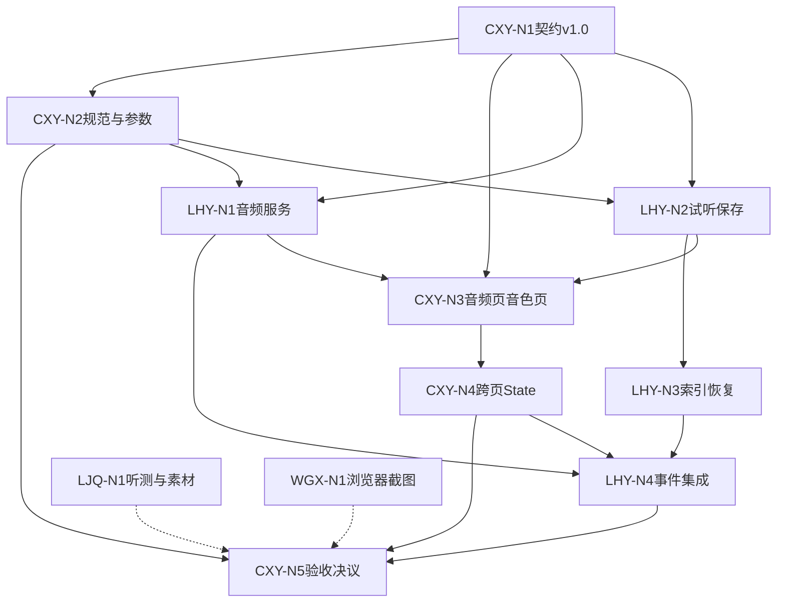

# Week 2 节点化开发计划：总览

> 本周目标：完成“音频处理 → 选择 3–10 秒片段 → 带入音色页 → 生成真实试听 → 保存音色 → 重启恢复”。  
> 工作方式：**CXY 与 LHY 两条关键链**并行，只在契约冻结、事件集成和最终验收处汇合；LJQ/WGX 提供非阻断补充证据。  
> 协作模式真值：[Team Plan v2 (CXY-Led).md](../Team%20Plan%20v2%20(CXY-Led).md) · 决议台账：[Decisions.md](../Decisions.md)

## 1. 三个协作指标

每个节点必须回答：

1. **哪些人的工作会影响我？**  
   只描述上游依赖，不写时间：
   - 无依赖：可独立开始；
   - 软依赖：可先工作，收到结果后对齐；
   - 硬依赖：必须收到指定交付物才能继续。

2. **我需要交付什么内容？**  
   必须是可检查的代码、页面、真实音频、JSON、日志、测试或文档。

3. **谁需要等待我完成该工作？**  
   写明接收人和用途；没有下游时写“无”。

节点状态沿用 Week 1：未开始、可开始、进行中、待交接、已完成、阻塞。

### 执行节奏与容量

- 单个节点预计不超过 **1.5 人日**；超过时拆分最小闭环和增强项。
- 周三中午前必须先跑通“合法短参考 → 真实试听 → 保存音色 → 重启恢复”的保底链路。
- 周四接入完整音频处理和跨页流程并预演；周五只修阻断问题和收集证据。
- 阻塞超过半天时写入 [Decisions.md](../Decisions.md)，由 CXY 直接裁定降级或改派，不开会讨论。
- 交接只用一种格式：`[节点ID] 产物路径 + 一行说明 + 已知限制`，**不需要接收人回复确认**。

## 2. 执行文件与本周负载

| 角色 | 执行文件 | 本周范围 | 节点数 |
|---|---|---|---:|
| **CXY** | [CXY Nodes.md](WorkScheduleGuide/CXY%20Nodes.md) | 契约 v1.0 冻结、参考规范与算法参数、音频页与音色页、跨页 State、验收 | 5 |
| **LHY** | [LHY Nodes.md](WorkScheduleGuide/LHY%20Nodes.md) | `audio_service`、`voice_service`、原子索引与重启恢复、事件集成 | 4 |
| LJQ | [LJQ Nodes.md](WorkScheduleGuide/LJQ%20Nodes.md) | 授权素材与人工听测（非阻断） | 1 |
| WGX | [WGX Nodes.md](WorkScheduleGuide/WGX%20Nodes.md) | 浏览器冒烟与截图归档（非阻断） | 1 |

参考文档：[GPU Environment Baseline.md](../GPU%20Environment%20Baseline.md)（环境矩阵由 CXY 维护）。

## 3. 工程主流程


备用路径：

```text
直接上传合格的 3–10 秒短参考
→ 填写准确参考文本
→ 生成真实试听
→ 保存音色
```

备用路径用于主跨页流程受阻时继续验证真实试听与保存，不能替代对跨页问题的记录和修复。

执行优先级：先保证备用路径形成真实、可持久化的最小闭环，再把完整音频处理链接入同一套 service。这样可以控制 LHY 的关键路径，但 Week 2 最终验收仍要求主跨页流程；未完成时必须记为“部分通过”。

## 4. 节点链

```text
CXY（关键链）：
  CXY-N1 契约v1.0冻结
    ├→ CXY-N2 参考规范与算法参数 ─┐
    └→ CXY-N3 音频页与音色页 → CXY-N4 跨页带入与State ─┴→ CXY-N5 端到端验收决议

LHY（关键链）：
  LHY-N1 audio_service ─────────────────┐
  LHY-N2 voice_service试听与保存 → LHY-N3 原子索引与重启恢复 ─┴→ LHY-N4 页面事件集成

LJQ（旁路）：LJQ-N1 授权素材与人工听测
WGX（旁路）：WGX-N1 浏览器冒烟与截图归档
```

## 5. 跨角色依赖



实线为硬依赖，虚线为非阻断补充证据。

避免循环等待：

- CXY-N1 先给出契约草案；首次正式保存音色前必须冻结 v1.0。
- CXY 的页面工作（N3）不等待 GPU，收到 service 返回结构后对齐。
- LHY 不等待 UI 即可实现 services 和测试；`voice_service` 可直接使用合法 3–10 秒短参考，不硬等待完整 `audio_service`。
- CXY 的算法参数（N2）与页面（N3）可并行，二者互不阻断。
- LHY-N4 是 UI 与 services 的统一汇合节点，CXY-N5 收口。

## 6. 关键交接

| 交接物 | 发出 → 接收 | 触发的下游工作 | 是否阻断 |
|---|---|---|---|
| Week 2 DoD 与契约 v1.0 | CXY-N1 → LHY | LHY-N1/N2 | 阻断 |
| 参考音频规范与切分/ASR/试听参数 | CXY-N2 → LHY | LHY-N1/N2 | 阻断 |
| `audio_service` 与数据集样例 | LHY-N1 → CXY | CXY-N3/N5 | 阻断 |
| `voice_service` 与真实试听入口 | LHY-N2 → CXY | CXY-N3/N5 | 阻断 |
| 音频页/音色页模块与跨页 State | CXY-N4 → LHY | LHY-N4 | 阻断 |
| 原子索引与恢复 | LHY-N3 → CXY | CXY-N5 | 阻断 |
| 集成版 `app.py` | LHY-N4 → CXY | CXY-N5 | 阻断 |
| 授权素材与人工听测表 | LJQ-N1 → CXY | CXY-N5 证据补充 | 非阻断 |
| 浏览器冒烟截图 | WGX-N1 → CXY | CXY-N5 证据补充 | 非阻断 |

发出人只需提供路径、版本和已知限制。**接收人不需要回复确认**；有异议按单条书面问题提交，由 CXY 在 24 小时内裁定。

## 7. AI 使用规则

- 提示词使用前补充实际路径、契约、源码版本和真实输入。
- AI 可帮助实现和审查，但负责人必须运行测试并检查输出。
- 不上传未经授权声音、密钥、个人信息或 `.env`。
- 不执行来源不明的依赖安装或删除命令。
- 不允许 AI 生成假的 ASR、切片、`preview.wav`、档案或成功状态。

## 8. 阶段 Demo

1. 一个命令启动 `app.py`。
2. 上传授权音频，完成裁剪、切分、ASR 与人工修正。
3. 生成真实 `dataset.list` 和 `dataset.json`。
4. 选择 3–10 秒片段并带入音色页。
5. 使用真实 GPT-SoVITS 生成 `preview.wav`。
6. 试听成功后保存音色，展示 `voice.json` 与 `voices.json`。
7. 停止并重新启动应用，确认音色卡片仍可加载。
8. 额外展示直接上传短参考的备用路径。
9. LJQ/WGX 若已交付，补充展示听测表与浏览器截图；未交付不影响阶段结论。

第 2–8 步由 CXY 现场操作，LHY 负责启动与后端问题现场排查。

验收：

- [ ] `.list` 四字段正确，`dataset.json` 可追溯。
- [ ] 合法片段能带入，非法时长被阻断。
- [ ] “生成音色”不提前写正式档案。
- [ ] “保存音色”只在真实试听成功后启用。
- [ ] `voice.json`、`voices.json` 与文件目录一致。
- [ ] 重启后音色恢复。
- [ ] 失败提示与日志真实，不使用 Mock。

## 9. 本阶段不做

- 不实现文本生成语音页的正式业务。
- 不实现结果管理和 `history.json`。
- 不追加多情绪参考，不做自动情绪分类。
- 不进行少样本训练或模型级解耦。
- 不增加独立 API、数据库或第二套前端。
- 不安排多方讨论会；范围与字段争议一律走 [Decisions.md](../Decisions.md) 由 CXY 裁定。
- 不把 LJQ/WGX 的旁路产物写成阶段通过的必要条件。

## 10. GPU 与环境（40 系 / 50 系）

主 GPU 轨道为 **CXY 本机（Track B）**；LJQ 的备用轨道为非阻断交叉验证，不要求统一 conda 环境。

- 真值文档：[GPU Environment Baseline.md](../GPU%20Environment%20Baseline.md)（§6 矩阵由 CXY 维护）
- Week 2 验收：`preview.wav` 必须来自主 Demo 机的项目真实推理。
- 环境变更（换包、换 PyTorch、换机器）后 24 小时内更新基线表与矩阵。
- 8 GB 显存约束下 GPU 重任务保持单任务串行。
